# Hi!

Matteo Francia, Ph.D.

- Email: m.francia@unibo.it
- Assistant Professor (junior) @ DISI, UniBO
- www: [https://www.unibo.it/sitoweb/m.francia/en](https://www.unibo.it/sitoweb/m.francia/en)

Teaching

- [DTM] Big Data and Cloud Platforms (Module 2)
- [DTM] Machine Learning and Data Mining (Module 2)

Research topics

- Big data / database / machine learning
- Precision agriculture and spatio-temporal analytics


# Participants presentation

# Agenda {background-color="#121011"}

**Introduction**

Data

- DBMS, Big Data, Cloud solutions
- Data Analytics
- Data Management and Data Governance
- Visualization of Data
- Statistics & Probability

Processing

- Artificial Intelligence (AI)
- Machine Learning (ML)

# Why is Data and Data Science Important?

Data has become the __fuel__ of industries as companies require data to function, grow and improve their businesses

> Analysing a large amount of data to derive __meaningful insights__, with the help of Data Scientists assist companies in making valuable (and rationalized) decisions

- __Real__ world __problems__ can be __solved__ with Data Science
- The number of __roles__ for Data Scientists has __grown__ by __650__% since 2012.
- About __11.5 Million jobs will__ be __created by 2026__ according to the U.S. Bureau of Labor Statistics.
- Data Science has __applications__ in __several__ fields
- Data Science is a very robust field that best fits people who enjoy __experimentation__ and __problem-solving__

# What is Data Science?

> "*Data Science* is about extraction, preparation, analysis, visualization, and maintenance of information. It is a cross-disciplinary field which uses scientific methods and processes to draw insights from data."

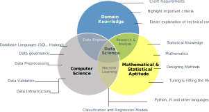

# Agenda {background-color="#121011"}

- Introduction

Data

- DBMS, Big Data, Cloud solutions
- **Data Analytics**
- Data Management and Data Governance
- Visualization of Data
- Statistics & Probability

Processing

- Artificial Intelligence (AI)
- Machine Learning (ML)

# Data Analytics

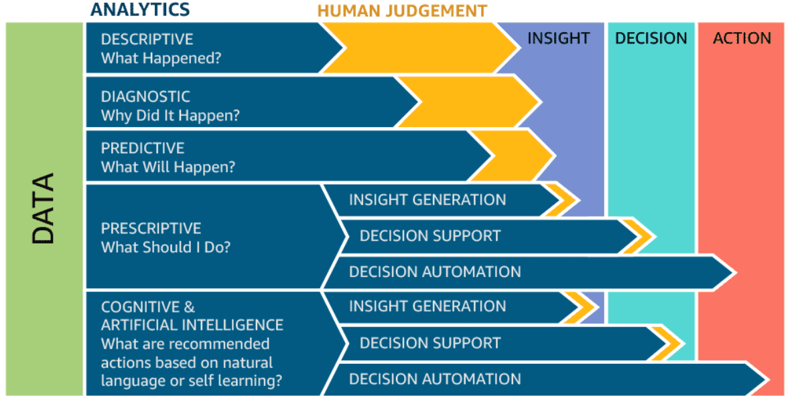

# Why data matters

**Data-Driven Innovation**

  * Use of data and  **analytics** to foster new products, processes, and markets
  * Drive discovery and execution of innovation, achieving new services with a business value

**Analytics**

* A catch-all term for different business intelligence (BI)- and application-related initiatives
  * E.g., of analyzing information from a particular domain
  * E.g., applying BI capabilities to a specific content area (e.g., sales, service, supply chain)

**Advanced Analytics**

* (Semi-)Autonomous examination of data to discover deeper insights, make predictions, or generate recommendations (e.g., through data/text mining and machine learning)

**Augmented Analytics**

* Use of technologies such as machine learning and AI to assist with data preparation, insight generation, and insight explanation to augment how people explore and analyze data

[https://www.gartner.com/en/information-technology/glossary](https://www.gartner.com/en/information-technology/glossary) (accessed 2022-08-01)

# Agenda {background-color="#121011"}

- Introduction

Data

- **DBMS, Big Data, Cloud solutions**
    - Big data
    - From databases to data platforms
    - Cloud computing
- Data Analytics
- Data Management and Data Governance
- Visualization of Data
- Statistics & Probability

Processing

- Artificial Intelligence (AI)
- Machine Learning (ML)

# Define big data

The term _big data_ comes in two flavors.

* Noun: "We have _big data_"
* Adjective: "We use _big data_ tools"

# Big data as a noun

When does data become _big_?

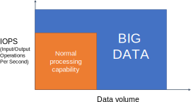

* "Big data _exceeds the reach of commonly used HW and SW_ environments to capture, manage, and process it within a tolerable elapsed time." </br> Teradata Magazine article (2011)
* "Big data refers to data sets whose _size is beyond the ability of typical database software_ tools to capture, store, manage, and analyze." </br> The McKinsey Global Institute (2012)

* "Big data is data sets that are _so voluminous and complex that traditional data processing application software is inadequate_ to deal with them." </br> Wikipedia

# Big data as a noun – The V's

::::{.columns}
:::{.column width="33%"}

The big-data cube [@meijer2012your]

* *Volume*: small to big
* *Variety*: structure to unstructured
* *Velocity*: pull to push

:::
:::{.column width="66%"}

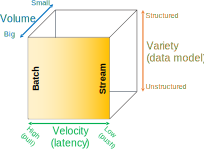

:::
::::

# Big data as a noun – The V's

](img/phdslides_2.jpg)

# Big data as a noun – The V's

::::{.columns}
:::{.column width="50%"}

*Volume*

* Large quantity of data

*Velocity*

* Refers to the speed of data production...
* ...and to the speed of consumption and analysis

*Variety*

* Structured, unstructured, multimedia

*Veracity*

* Refers to the trustworthiness of data
* Potentially inconsistent, incomplete, ambiguous, obsolete, false, approximate

...

:::
:::{.column width="50%"}

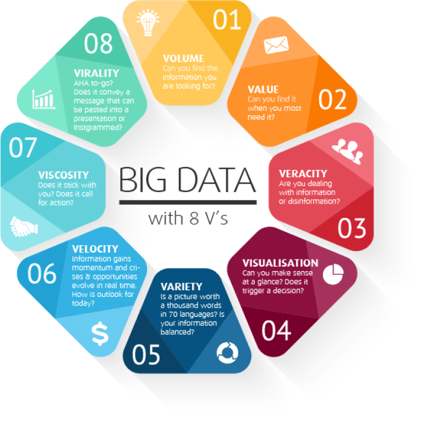

:::
::::

# Big data as an adjective

* When used as a noun, the boundary between _normal_ and _big_ data is vague
* When used as an adjective, its meaning is more specific
  * *Big data architecture* (e.g., the Lambda architecture)
  * *Big data tools* (e.g., Apache Spark)
  * *Big data paradigm* (e.g., Map-Reduce)

# Why the hype?

)](img/etf-bigdata.png)

# Why the hype?

- [The Tropical Island With the Hot Domain Name](https://www.bloomberg.com/news/articles/2023-08-31/ai-startups-create-digital-demand-for-anguilla-s-website-domain-name)
- [These Prisoners Are Training AI](https://www.wired.com/story/prisoners-training-ai-finland/)
- [Amazon Mechanical Turk](https://www.mturk.com/)
- [IA e Lavoro Gen-Z](https://www.ilsole24ore.com/art/l-intelligenza-artificiale-gia-ruba-lavoro-giovani-gen-z-AHgfnmz)
- [Google turns to nuclear to power AI data centres](https://www.bbc.com/news/articles/c748gn94k95o)
- [‘We definitely messed up’: why did Google AI tool make offensive historical images?](https://www.theguardian.com/technology/2024/mar/08/we-definitely-messed-up-why-did-google-ai-tool-make-offensive-historical-images)
- [Why Google's 'woke' AI problem won't be an easy fix](https://www.bbc.com/news/technology-68412620)

# Why the hype?

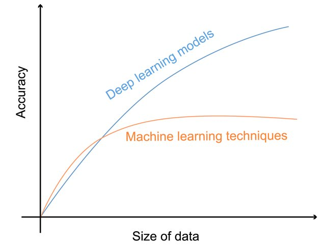

# Why the hype?

::::{.columns}
:::{.column width="25%"}
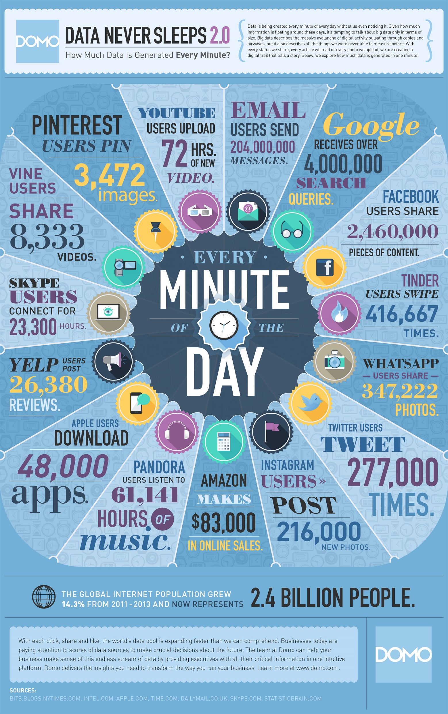
:::
:::{.column width="25%"}
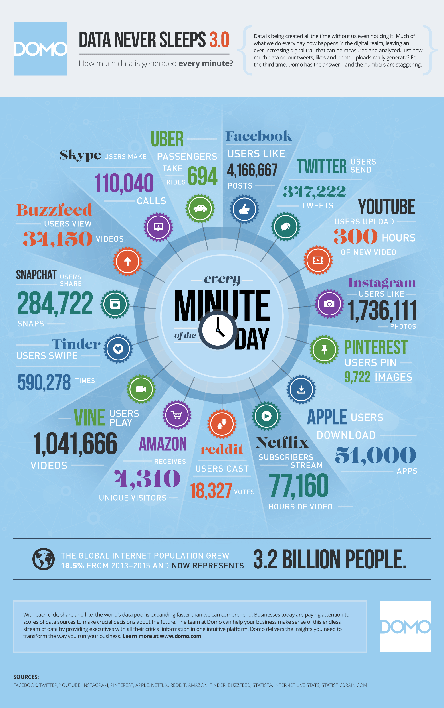
:::
:::{.column width="25%"}
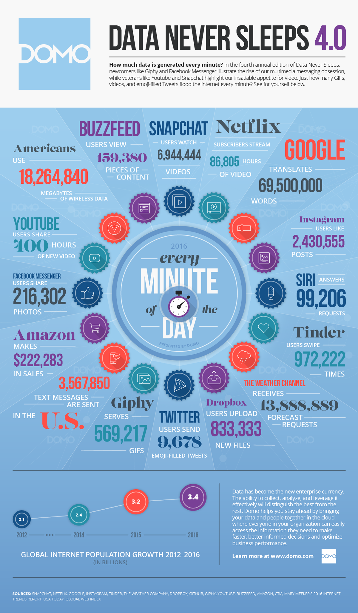
:::
:::{.column width="25%"}
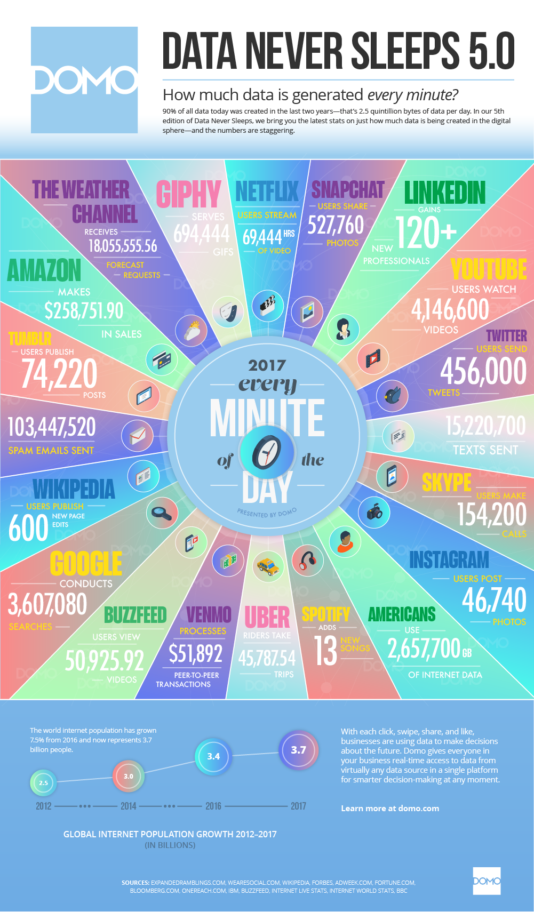
:::
::::

[https://www.domo.com/data-never-sleeps\#](https://www.domo.com/data-never-sleeps) (accessed 2023-06-14)

# Data never sleeps

::::{.columns}
:::{.column width="25%"}
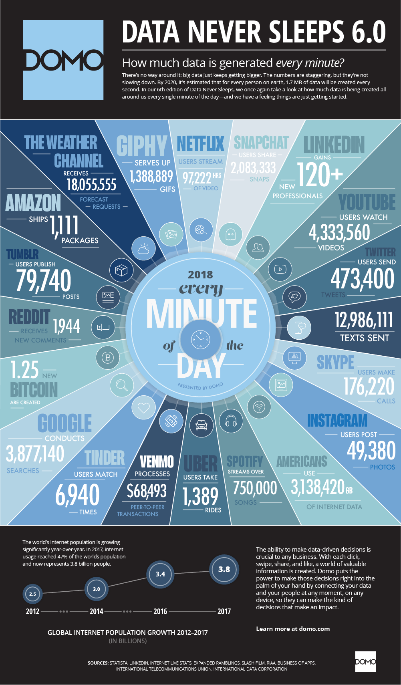
:::
:::{.column width="25%"}
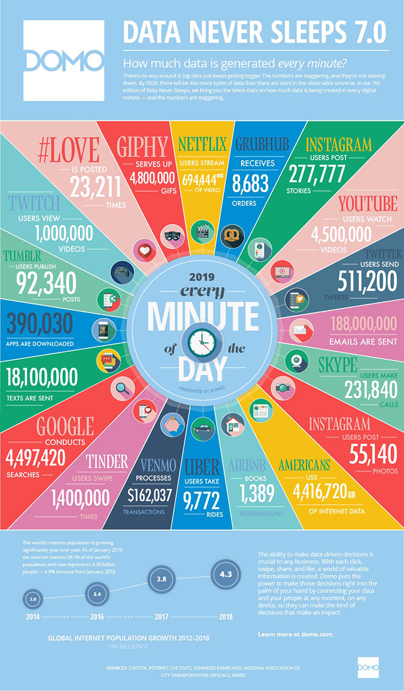
:::
:::{.column width="25%"}
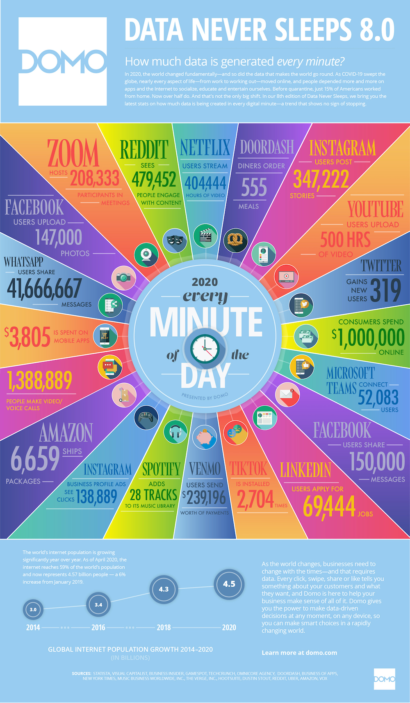
:::
:::{.column width="25%"}
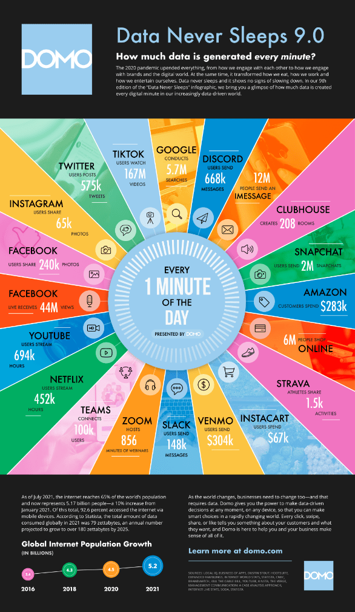
:::
::::

[https://www.domo.com/learn/data-never-sleeps-9](https://www.domo.com/learn/data-never-sleeps-9)

# Data never sleeps: The Netflix scenario

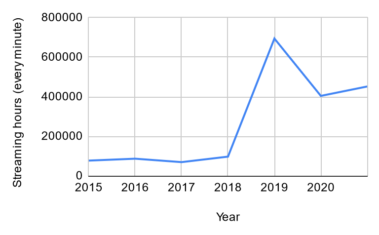

[https://www.domo.com/learn/data-never-sleeps-9](https://www.domo.com/learn/data-never-sleeps-9)

# Data never sleeps

::::{.columns}
:::{.column width="25%"}

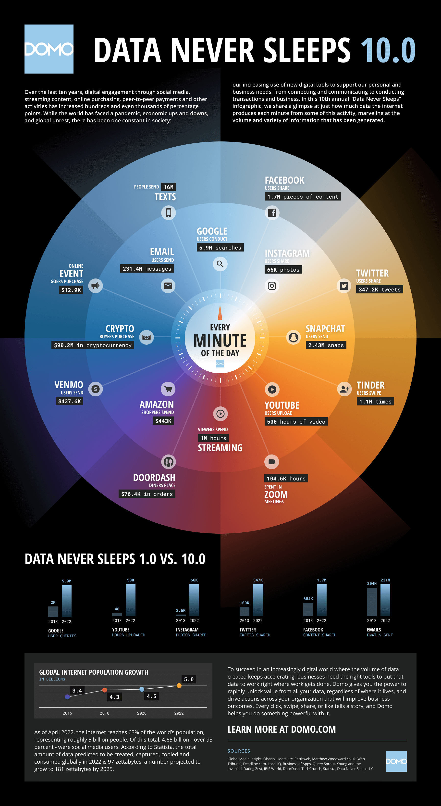

:::
:::{.column width="75%"}

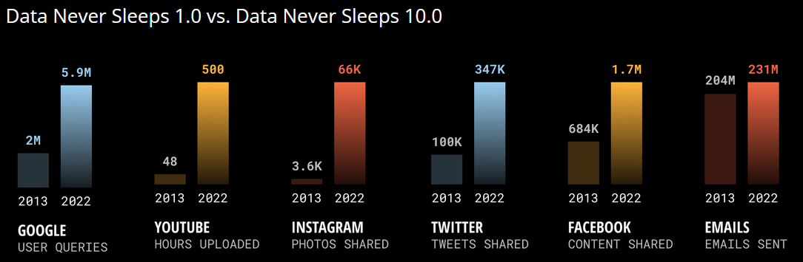

:::
::::

[https://www.domo.com/data-never-sleeps\#data](https://www.domo.com/data-never-sleeps#data) (accessed 2023-06-14)

# From databases to data platforms

::::{.columns}
:::{.column width=50%}

> **Database** [@ozsu2018]
>
> "A database is a _structured and persistent collection_ of information about some aspect of the real world, organized and stored in a way that facilitates efficient retrieval and modification. The structure of a database is determined by an _abstract data model_. Primarily, it is this structure that differentiates a database from a data file."

:::
:::{.column width=50%}

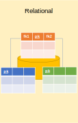

:::
::::

# From databases to data platforms

At the beginning, computer science was seen as a *subsidiary discipline* that makes information management *faster* and *cheaper*

- ... but *did not create (new) profits in itself*

The main goal of databases in companies has been that of storing **operational data** [@DBLP:journals/cacm/Codd70]

- Data generated by operations carried out within business processes

**Online transaction processing (OLTP)** is a type of database system used in transaction-oriented applications, such as many operational systems.

- "Online" refers to the fact that such systems are expected to respond to user requests and process them in real-time.
- Large number of database transactions (writing and reading data) in real-time

# From databases to data platforms

An exponential increase in operational data has made computers the only tools suitable for *decision-making performed by business users*

- The massive use of techniques for analyzing enterprise data made information systems a key factor to achieve business goals

The role of computer science in companies has radically changed since the early 70's.

- ICT systems turned from simple tools to improve process efficiency...
- ... into key factors of company organizations capable of deeply impacting on the structure of business processes

# Problem: how do we manage **data heterogeneity**?

# From databases to data platforms

::::{.columns}
:::{.column width=50%}

> **Schemaless databases**
>
> There is no predefined schema that the data must conform to before being added to the database.
> As a result, you don't need to know the structure of your data, enabling you to store all your data more easily and quickly.

:::
:::{.column width=50%}

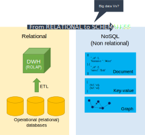

:::
::::

# Problem: how do we transform data into **actionable business insights**?

# From databases to data platforms

*Big Data* must be transformed into *Small Data* so that it can be exploited for decision-making purposes

- Small data is data that is "small" enough for human comprehension.
- It is data in a volume and format that makes it accessible, informative and actionable.


# From databases to data platforms

Scenario:

- Large company, with several branches
- Managers wish to quantify and evaluate the contribution given from each branch to the global profit

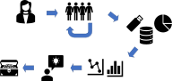

# From databases to data platforms

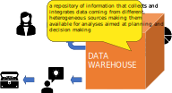

# From databases to data platforms

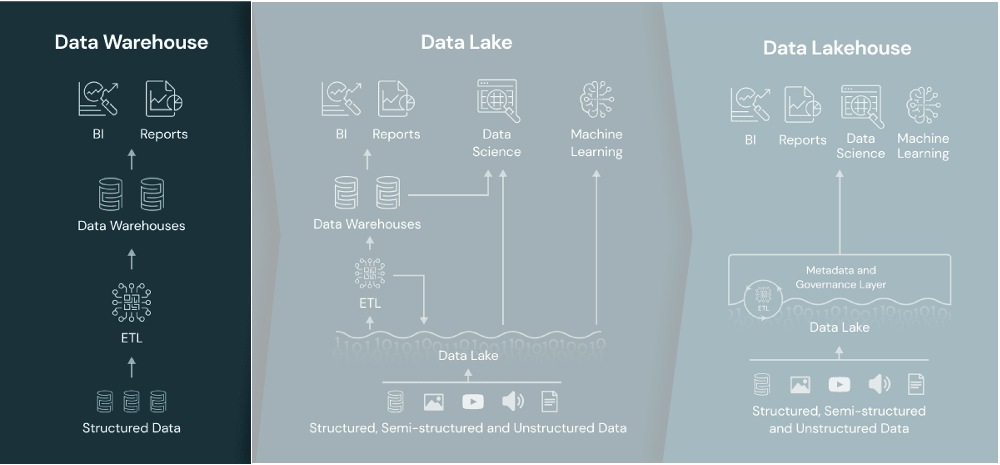

# From databases to data platforms

::::{.columns}
:::{.column width=50%}

> **Data Warehouse (DWH)** [@golfarelli2009data]
>
> "A collection of data that supports decision-making processes. It provides the following features: subject-oriented, integrated and consistent, not volatile."

:::
:::{.column width=50%}

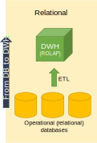

:::
::::

# From databases to data platforms

A DWH is a collection of data that supports decision-making processes. It provides the following features:

- It is *subject-oriented*;
- It is *integrated and consistent*;
- It shows its *evolution over time and it is not volatile*

The **multidimensional model** is the key for representing and querying information in a DW

- (Business) *Facts* of interest are represented in *(hyper) cubes* where:
  - Each cell stores *numerical measures* that quantify the fact from different points of view;
  - Each axis is a *dimension* for analyzing measure values;
  - Each *dimension can be the root of a hierarchy* of attributes used to aggregated measure values

**Online analytical processing (OLAP)** to answer multi-dimensional analytical queries.

- Interactive sessions of analysis reading large amounts of data.

# From databases to data platforms

Querying the cube with OLAP operators: *roll up*

::::{.columns}
:::{.column width=50%}

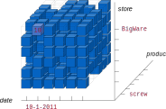

:::
:::{.column width=50%}

:::{.fragment}

:::
:::
::::

# From databases to data platforms

Querying the cube with OLAP operators: *drill down*

::::{.columns}
:::{.column width=50%}


:::
:::{.column width=50%}
:::{.fragment}
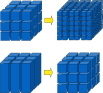
:::
:::
::::

# From databases to data platforms

The **Dimensional Fact Model** [@DBLP:journals/ijcis/GolfarelliMR98] is a graphical conceptual model for DWH design, devised to:

- create an environment in which user queries may be formulated intuitively
- make communication possible between designers and end users with the goal of formalizing requirement specifications
- build a stable platform for logical design (independently of the target logical model)
- provide clear and expressive design documentation

<div></div>

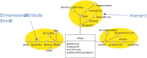

# From databases to data platforms

::::{.columns}
:::{.column width=50%}


:::
:::{.column width=50%}

:::{.fragment}
![Corresponding Entity-Relationsip representation [@DBLP:conf/hicss/GolfarelliMR98]](img/cube-dfm.png)
:::
:::
::::

# From databases to data platforms: OLTP vs OLAP

| Characteristic | OLTP | OLAP |
|:-: |:-: |:-: |
| Type of workload | Constant transactions (reads/writes) | Periodic large writes, interactive large reads |
| Examples | Accounting database, online retail transactions | Reporting, decision support |
| Type | Operational data | Business data |
| Data retention | Short-term (2-6 months) | Long-term (2-5 years) |
| Storage | Gigabytes (GB) | Terabytes (TB) / Petabytes (PB) |
| Users | Many | Few |

# From databases to data platforms

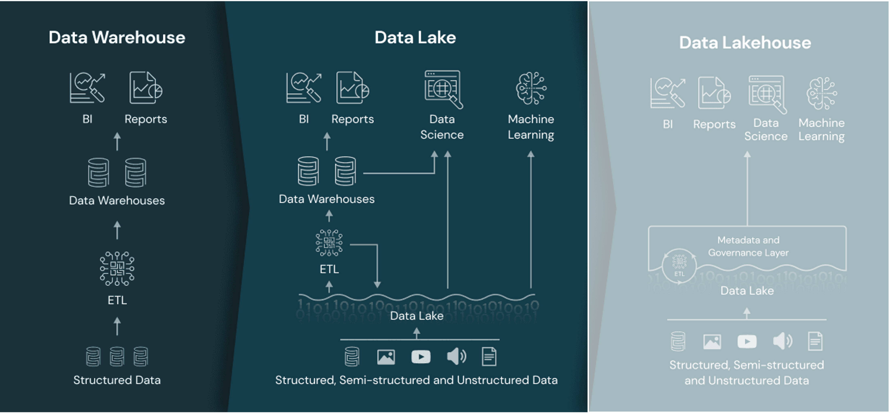

# From databases to data platforms

::::{.columns}
:::{.column width=50%}

> **Data lake** [@couto2019mapping]
>
> "A DL is a _central repository_ system for _storage, processing, and analysis of raw data_, in which the data is kept in its _original format and is processed to be queried only when needed_. It can _store a varied amount of formats_ in big data ecosystems, from unstructured, semi-structured, to structured data sources."

:::
:::{.column width=50%}

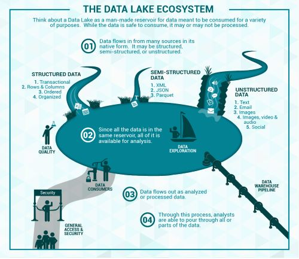

:::
::::

# Data lakehouse [@armbrust2021lakehouse]

::::{.columns}
:::{.column width=50%}

> **Data lakehouse**
>
> Data management architecture that combines the flexibility, cost-efficiency, and scale of data lakes with the data management and ACID transactions of DWHs, enabling business intelligence (BI) and machine learning (ML) on all data

Key technologies used to implement Data Lakehouses

- Databricks' Delta Tables
- Apache Hudi
- Apache Iceberg

:::
:::{.column width=50%}

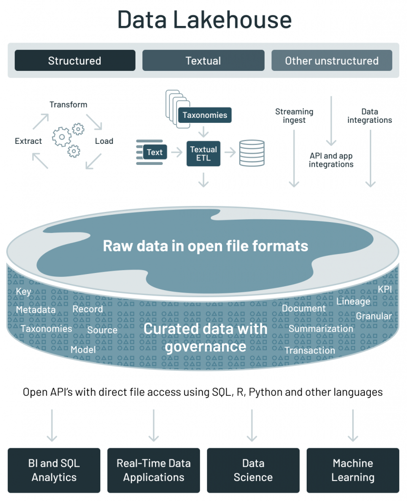

:::
::::

[https://databricks.com/blog/2021/05/19/evolution-to-the-data-lakehouse.html](https://databricks.com/blog/2021/05/19/evolution-to-the-data-lakehouse.html)

[https://www.databricks.com/glossary/data-lakehouse](https://www.databricks.com/glossary/data-lakehouse)

# From databases to data platforms

*Data lakes (or lakehouses)* have increasingly taken the role of *data hubs*

- Eliminate up-front costs of ingestion and ETL since data are stored in the original format
- Once in DL, data are available for analysis by everyone in the organization

*Drawing a sharp line between storage/computation/analysis is hard*

- Is a database just storage?
- What about SQL/OLAP?

*Blurring* of the *architectural borderlines*

- DL is often replaced by "data platform" or "data ecosystem"
- Encompass systems supporting data-intensive storage, computation, analysis

# From databases to data platforms

> **Data platform**
>
> A *unified* infrastructure that facilitates the ingestion, storage, management, and exploitation of large volumes of heterogeneous data. It provides a collection of *independent* and *well-integrated* services meeting *end-to-end* data needs.
>
> - *Unified*: is conceptually a data backbone
> - *Independent*: a service is not coupled with any other
> - *Well-integrated*: services have interfaces that enable easy and frictionless composition
> - *End-to-end*: services cover the entire data life cycle

Rationale: relieve users from the complexity of administration and provision

- Not only technological skills, but also privacy, access control, etc.
- Users should only focus on functional aspects

# From databases to data platforms

Are we done? No!

- Lacking smart support to govern the complexity of data and transformations
- Data transformations must be governed to prevent DP from turning into a swamp
  - Amplified in data science, with data scientists prevailing over data architects
  - Leverage descriptive metadata and maintenance to keep control over data

# Which functionalities for (automated) data management can you think about?

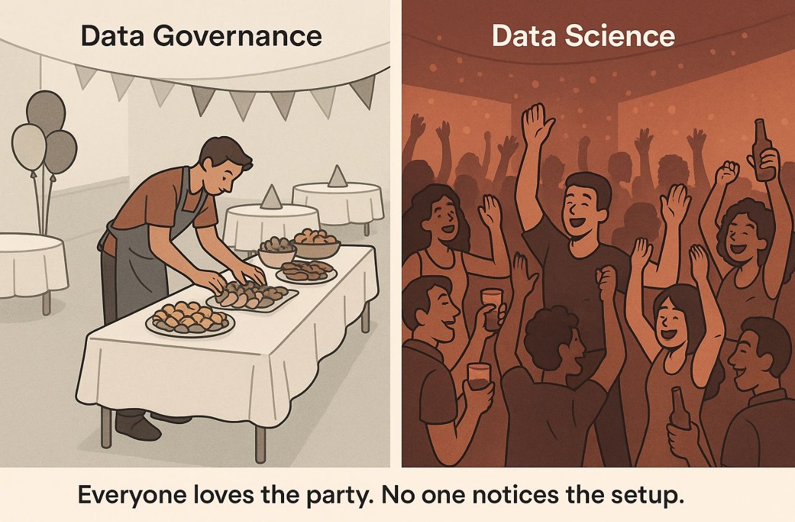

# Managing data platforms

- *Tracking data pipelines*: Data provenance
- *Tracking changes*: Data versioning
- *Saving storage*: Compression
- *Understanding the data*: Data profiling
- *Integrating data sources*: Entity resolution
- ...

# Data governance

::::{.columns}
:::{.column width=60%}

> **Data governance**
>
> Techniques to ensure that data is secure, private, accurate, available, and usable

- It includes the actions people must take, the processes they must follow, and the technology that supports them throughout the data life cycle
- Every organization needs data governance since industries proceed on their digital-transformation journeys

A *data steward* is a role that ensures that data governance processes are followed and that guidelines are enforced, and recommends improvements to data governance processes.

:::
:::{.column width=40%}

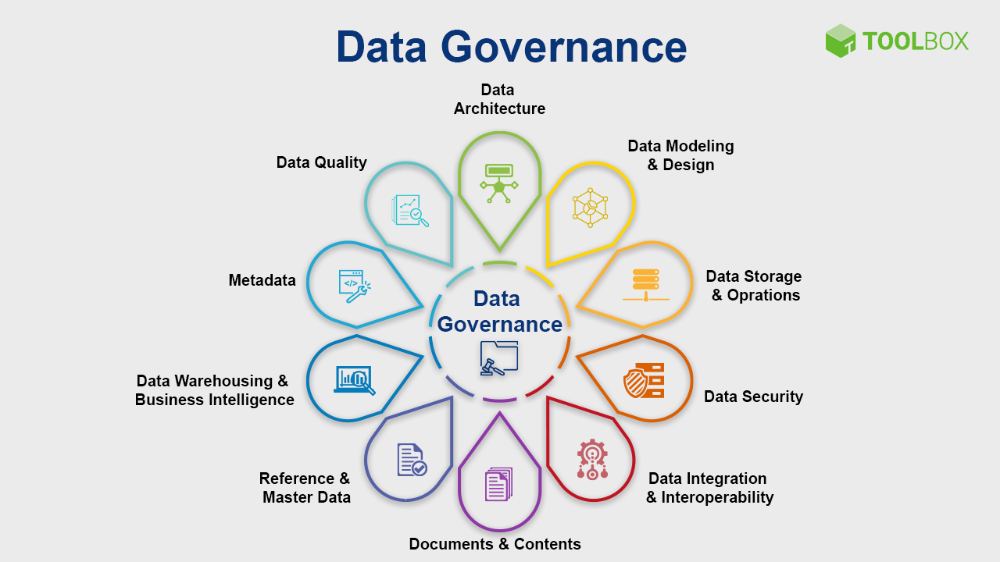

:::
::::

# On-premises vs cloud

First installations were primarily on-premises

* *Installation*: how do I set up a new machine?
* *Networking*: how do I cable dozens of machines?
* *Management*: how do I replace a broken disk?
* *Upgrade*: how do I extend the cluster with new services/machines?
* (energy and cooling, software licenses, insurance...)

Cloud providers are mature and offer comprehensive support for big data ecosystems.

* Forget all that is above

# [Cloud computing](https://w4bo.github.io/AA2526-unibo-bigdataandcloudplatforms/07-computing)

A model for enabling  **minimal management effort** or service provider interaction

* *On-demand self-service* (consume services when you want)
* *Broad network access* (consume services from anywhere)
* *Broad network deployment* (deploy services anywhere)
* *Resource pooling* (infrastructure, virtual platforms, and applications)
* *Rapid elasticity* (enable horizontal scalability)
* *Measured service* (pay for the service you consume as you consume)
* *Reliability* (fault-tolerance handled by the provider)

#

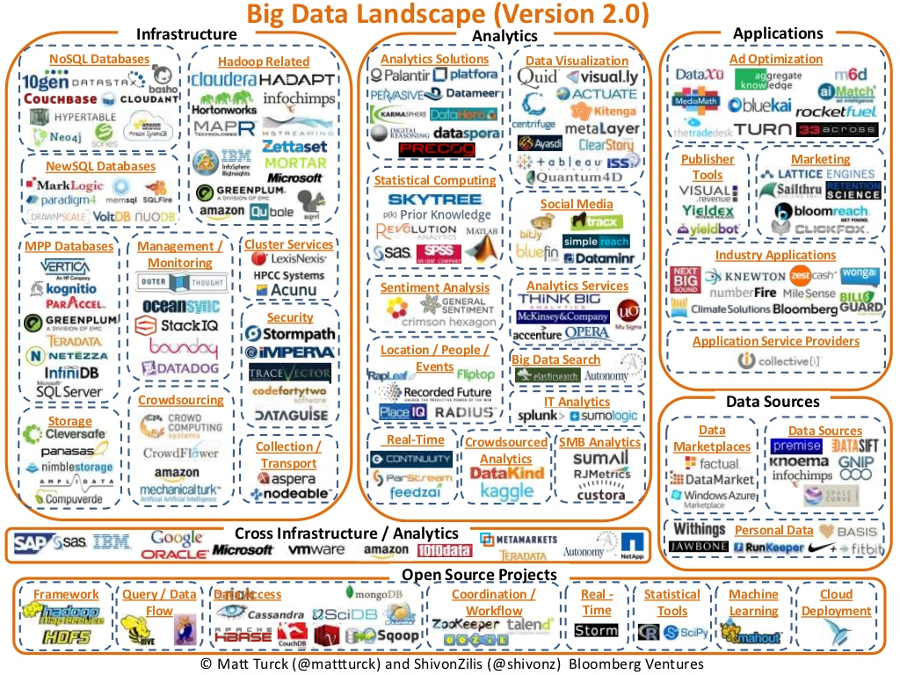

#

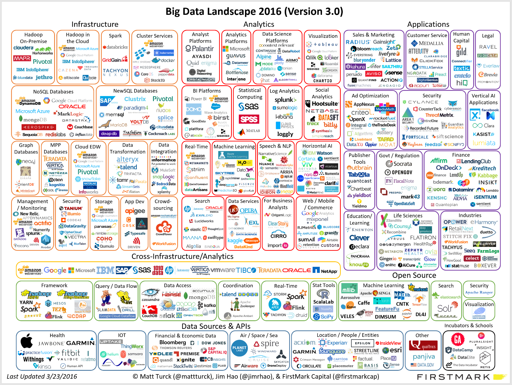

#

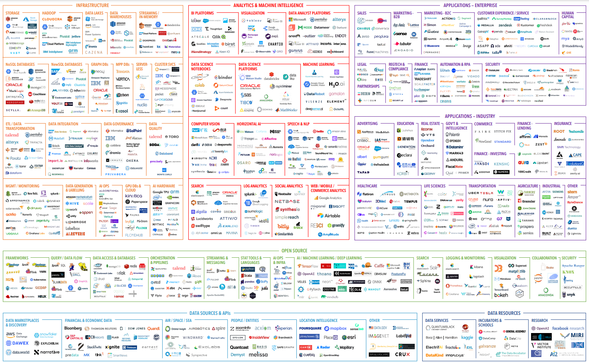

# Agenda {background-color="#121011"}

- Introduction

Data

- DBMS, Big Data, Cloud solutions
- Data Analytics
- **Data Management and Data Governance**
- Visualization of Data
- Statistics & Probability

Processing

- Artificial Intelligence (AI)
- Machine Learning (ML)

# What is Data Management?

Having data and using it means it _needs_ to be _managed_.

The _Data Management Body of Knowledge_ (DMBOK) model defines _how_ to _manage data_ in a professional organisation.

DAMA-DMBOK represents data management in the form of _11 Knowledge Areas_, represented on the famous DAMA Wheel.

- At the _heart_ of data management is __Data Governance__.

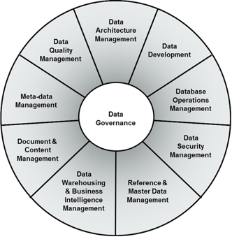

# What is Data Governance?

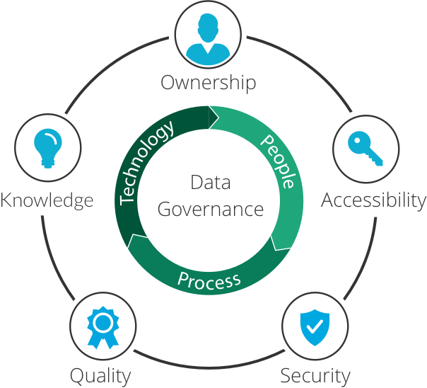

Data governance is a system for defining who within an organization has authority and control over data assets how those data assets may be used.

- It encompasses the people, processes, and technologies required to manage and protect data assets.

# Goals of Data Governance


- Define, approve and communicate __data strategies__, policies, standards, architecture and metrics (KPIs)  ​
- Follow and enforce __compliance__ with law, policies, standards, architecture and procedures
- Sponsor, follow and control __delivery__ of data management __projects__ and __services__   ​
- __Manage__ and __solve__ data related __issues__
- Understand and advocate __importance__ and __value__ of __data__ sets

# Topics Closely Related to Data Governance


Four examples of _topics closely related_ to _data governance_ are:

* _Data stewardship_: a __functional role__ in data management and governance, with responsibility for __ensuring__ that data __policies__ and __standards turn__ into __practice__ within the steward's domain
* _Data quality_: a __measure__ of the __condition__ of data based on factors such as _accuracy_, _completeness_, _consistency_, _reliability_ and whether it's up to date
* _Master data management_: a __discipline__ in which __business__ and __IT work together__ to ensure the uniformity, accuracy, stewardship, semantic consistency and accountability of the enterprise's official shared master data assets
* _GDPR_: the __biggest data privacy use case__ in Data Governance of recent years

# GDPR - what is?


> Regulation on the protection of natural persons with regard to the processing of personal data and on the free movement of such data, and repealing Directive 95/46/EC (General Data Protection Regulation)

# GDPR - what is?

- The General Data Protection Regulation is the __toughest privacy__ and __security law__ in the __world replacing__ national data protection laws of __all EU member states__.
- Though it was drafted and passed by the European Union (EU), __it also has international reach__ - applying to any organization that processes data of EU data subjects.
- The regulation was __put into effect on May 25, 2018__.
    - Fines for non-compliance will increase substantially up to a maximum fine of € 20 million or 4% of global annual sales, whichever is higher


# GDPR - why?

GDPR IS ABOUT GIVING _CONTROL OVER PERSONAL DATA BACK TO PEOPLE_

- No _single_ set of rules in EU
- Uncontrolled _collection_ and _storage_ of personal data
- Inability to _withdraw_ from direct marketing
- No _control_ over provided consent
- _Lack_ of procedures for data _accuracy_
- _GDPR has fundamentally changed the way companies must manage personal data_


# GDPR - sensitive personal data

_Personal data_

__Article 4(1)__: "Any information relating to an __identified__ or __identifiable__ natural person ("data subject"); an __identifiable person__ is one who can be identified, directly or indirectly, in particular __by reference to an identifier__ such as a _name_, an _identification_ number, _location_ data, online identifier or to one or more factors specific to the physical, physiological, genetic, mental, economic, cultural or social identity of that person."

_SENSITIVE Personal data_

__Article 9(1)__: "Sensitive Personal Data" are personal data, revealing __racial__ or __ethnic__ origin, __political opinions__, __religious__ or __philosophical__ beliefs, trade-union membership;

* HEALTH DATA (Art.4(15)) or sex life and sexual orientation
* GENETIC DATA  (Art.4(13))
* BIOMETRIC DATA (Art.4(14))
* Data relating to criminal offences and convictions are addressed separately (as criminal law lies outside the EU's legislative competence)

# Agenda

Introduction

Data

- DBMS, Big Data, Cloud solutions
- Data Analytics
- Data Management and Data Governance
- **Visualization of Data**
- Statistics & Probability

Processing

- Artificial Intelligence (AI)
- Machine Learning (ML)

# What is Data Visualization?

Data __visualization__ tools and technologies are __essential__ to __analyze massive amounts__ of information and make __data-driven decisions__.

- Data visualization helps to tell stories by curating data into a form easier to understand, highlighting the __trends__ and __outliers__.
- Data visualization can also __unlock the ability of less technical__ users to explore and interact with data

_A good visualization tells a story, removing the noise from data and highlighting the useful information._

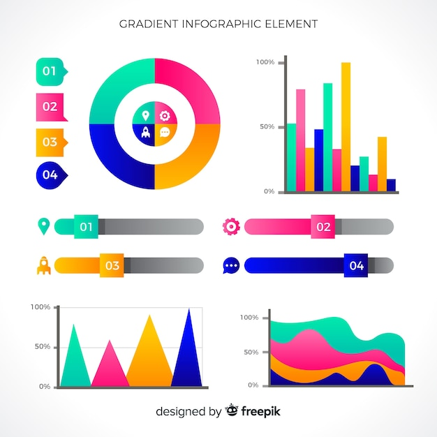

# The Power of Visuals

_A picture tells more than a thousand words. A chart tells more than a million data points_

__Human Vision__

Humans are visual by __Nature__

- __90__ percent of information transmitted to the brain is __visual__
- __65__ percent of the population are visual learners, __graphics__ are __key__ to __engaging__ employees

The human brain processes __Visual__ data _60.000 times_ better than __Textual__ data

::::{.columns}
:::{.column width=50%}

:::
:::{.column width=50%}
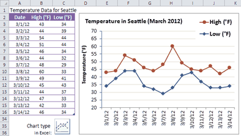
:::
::::

# The Power of Visuals

Visual Deception

::::{.columns}
:::{.column width=50%}

:::
:::{.column width=50%}

:::
::::

# The Power of Visuals

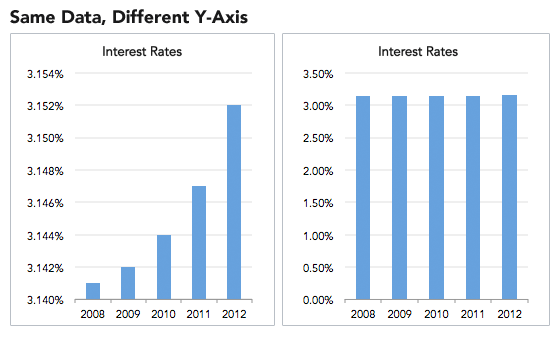

# The Power of Visuals

[How to lie with data visualization](https://heap.io/blog/data-stories/how-to-lie-with-data-visualization)

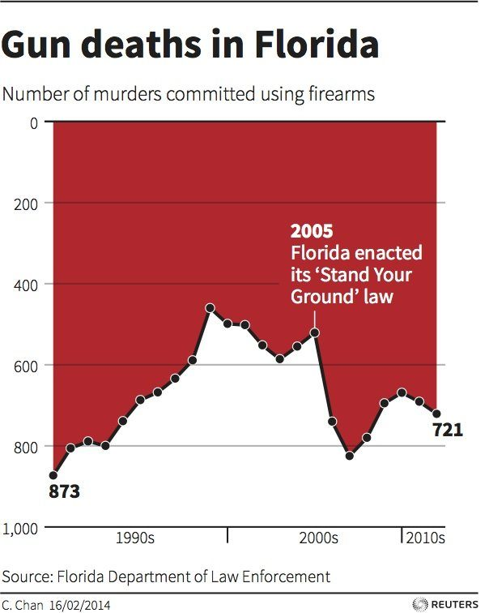

> A stand-your-ground law, sometimes called a "line in the sand" or "no duty to retreat" law, provides that people may use deadly force when they reasonably believe it to be necessary to defend against certain violent crimes (right of self-defense). Under such a law, people have no duty to retreat before using deadly force in self-defense, so long as they are in a place where they are lawfully present.

An __upside down Y-axes__ with descending (instead of ascending) values to the top might for a moment give the _wrong_ impression that the ‘Stand your ground law' was _positive_ in relation to gun deaths

# Information Visualization Do's

::::{.columns}
:::{.column width=50%}

:::
:::{.column width=50%}
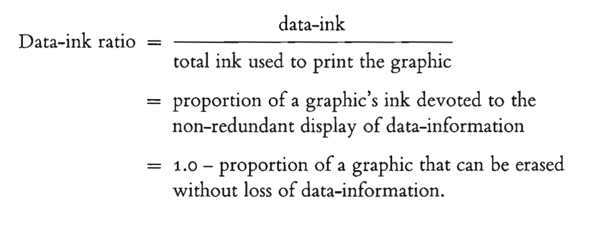
:::
::::

Align with the _data savviness_ of end user

- Choose the _right_ chart _type_ with respect to your data
- _Describe_ keywords, KPI's, terms, metrics
- Design a _simple_ and _understandable_ data model
- _Pre-filter_ a dashboard to information that is _relevant_ for the user
- Make charts with the _Data-Ink ratio_ in mind

# Information Visualization Don'ts

- Don't use Pie Charts (_Google: save the pies for dessert_)
- Don't overload the (Dashboard) user with information
- Don't present various unknown values
- Don't use KPI with a bad metric or no target/context

::::{.columns}
:::{.column width=25%}
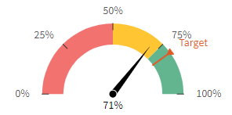
:::
:::{.column width=25%}
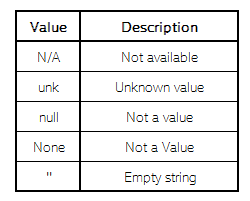
:::
:::{.column width=25%}
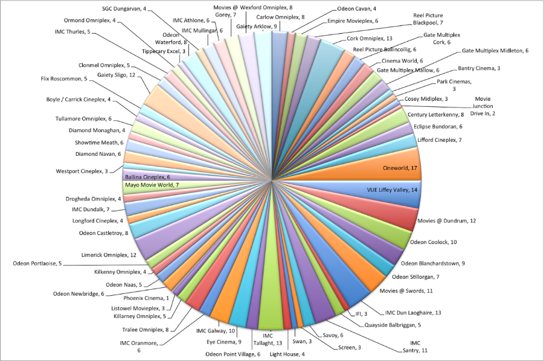
:::
:::{.column width=25%}
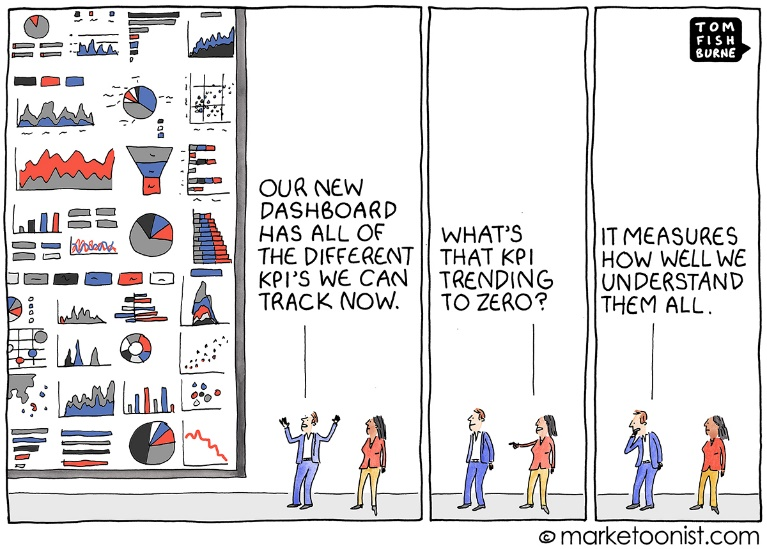
:::
::::

# Information Visualization Do's

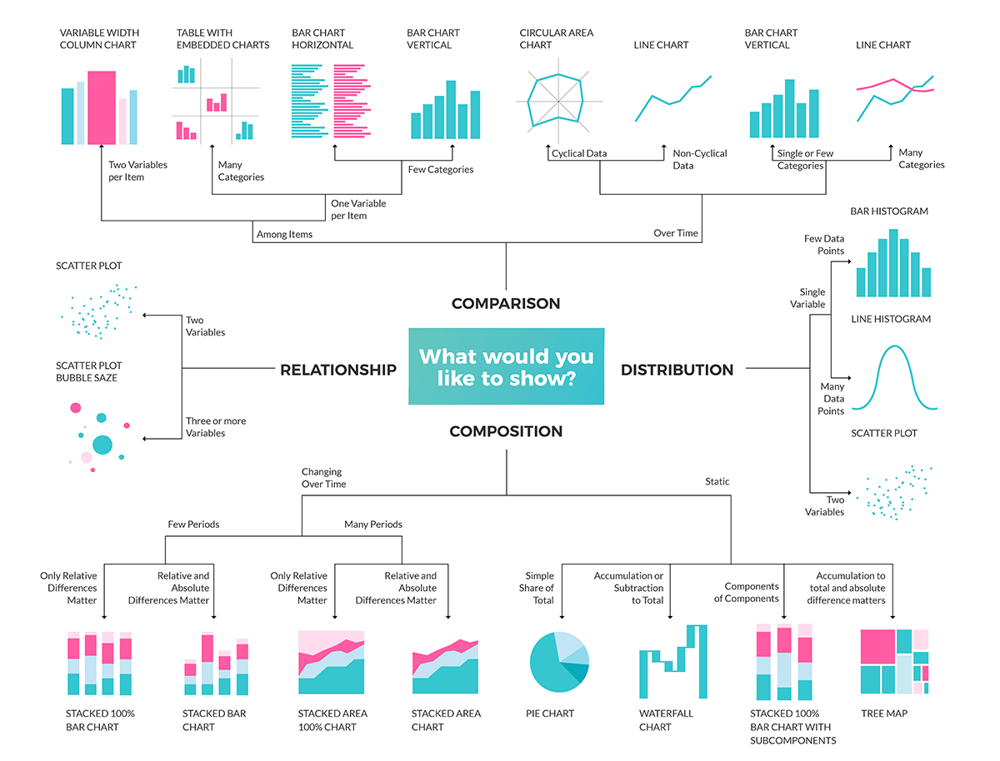

# Agenda

Introduction

Data

- DBMS, Big Data, Cloud solutions
- Data Analytics
- Data Management and Data Governance
- Visualization of Data

Processing

- **Artificial Intelligence (AI)**
- Machine Learning (ML)

# Data Mining

> **Data mining** [@chakrabarti2006data]
>
> - ... Is the process of extracting and discovering patterns in large data sets
> - ... Involving methods at the intersection of machine learning, statistics, and database systems.
> - It is an interdisciplinary subfield of computer science and statistics

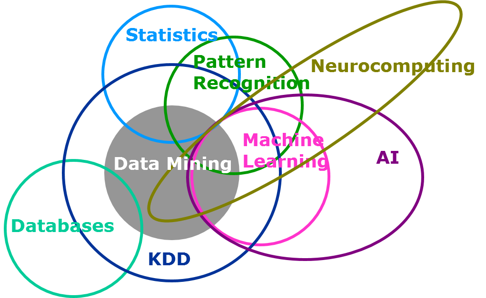

# Machine Learning

Machine learning (ML) is a field of study in artificial intelligence

- The development and study of statistical algorithms that can learn from data
- ... and generalize to unseen data and thus perform tasks without explicit (coding) instructions

> **Machine Learning** [@mitchell1997machine] is the study of algorithms that
>
> - Improve their performance $P$
> - At some task $T$
> - With experience $E$
> - A well-defined learning task is given by $<P, T, E>$

# Classical Programming vs Machine Learning


# A Simple Example: Calculator

Create a calculator that computes the sum of two numbers

**T**ask: $Z = X + Y$

# Classical Programming

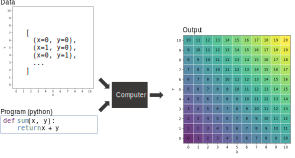

# Machine Learning

(Supervised) Machine learning is usually divided into two steps:

- Train with **E**xperience (training set)
- Generalize to unseen data (test set) and evaluate the **P**erformance
- Training and test sets are not overlapping (they do not share the same data)

# Training the model

**E**xperience: training data

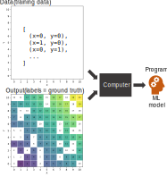

# Testing the Model

**P**erformance: checking accurate predictions

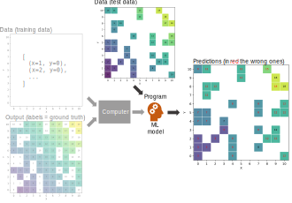

#


# Taxonomy of Machine Learning

Machine Learning

- **Supervised Learning**: models are trained using labeled data to learn a mapping from inputs to labels
- **Unsupervised Learning**: algorithms find patterns, structures, and insights in unlabeled data without predefined answers
- **Reinforcement Learning**: an agent learns to make optimal decisions by interacting with a dynamic environment through trial-and-error

# Taxonomy of Machine Learning

Machine Learning

- *Supervised Learning*: models are trained using labeled data to learn a mapping from inputs to *labels*
    - **Classification**: the label is nominal; spam detection (`yes`/`no`), diagnosis (`healthy`/`sick`)
    - **Regression**: the label is continuous; house price, temperature
- Unsupervised Learning
- Reinforcement Learning

# Taxonomy of Machine Learning

Machine Learning

- *Supervised Learning*
    - *Classification*: the label is nominal; spam detection (`yes`/`no`), diagnosis (`healthy`/`sick`)
        - **Model-Based Methods**: learn an explicit model to generalize from training data
            - Decision Trees
            - Neural Networks
        - **Instance-Based Methods**: store training examples and compare new inputs to known cases
            - k-Nearest Neighbors
        - **Ensemble Methods**: combine multiple models to improve performance
            - Random Forests
    - Regression
        - Model-Based Methods
        - Instance-Based Methods
- Unsupervised Learning
- Reinforcement Learning

# Classification: Model-Based Methods

Training: learn a model to generalize from training data

```{mermaid}
%%| echo: false
flowchart LR
    A[(Training Data)] --> B[Training / Model Learning]
    B --> C[(Trained Model)]
```

# Classification: Model-Based Methods

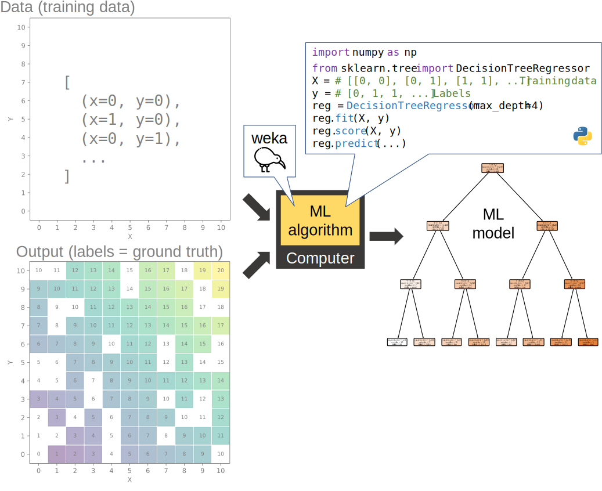

# Classification: Model-Based Methods

Testing: verify the generalization of the model on unseen data

- Use the trained model to make predictions on new data
- Compare predictions to ground truth for performance evaluation

```{mermaid}
%%| echo: false
flowchart LR
    A[(Test Data)] --> B[Trained Model]
    B --> C[(Predicted Class)]
    C --> D[Evaluation]
    E[(Real Class / Ground Truth)] --> D
    D --> F(Performance Metric)
```

# Classification: Model-Based Methods

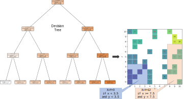

# Classification: Instance-Based Methods

Instance-based methods: store training examples and compare new inputs to known cases

* No explicit training phase
* Rely on similarity or distance measures
* Can be sensitive to noise and data size

```{mermaid}
%%| echo: false
flowchart LR
    A[(Test Data)] --> B[Compare]
    C[(Training Data)] --> B
    B --> D[(Predicted Class)]
    D --> E[Evaluation]
    F[(Real Class / Ground Truth)] --> E
    E --> G(Performance Metric)
```

# Classification: Instance-Based Methods


# Reinforcement Learning

_Reinforcement machine learning algorithms_ interact with their environment by producing actions and discovering errors or rewards.

- _Trial and error search_ and _delayed reward_ are the most relevant characteristics of reinforcement learning.

- Allows machines and software agents to _automatically determine_ the _ideal behavior_ within a specific context in order to maximize its performance.

Simple _reward feedback_ is required for the agent to learn which action is best - a _reinforcement signal_.

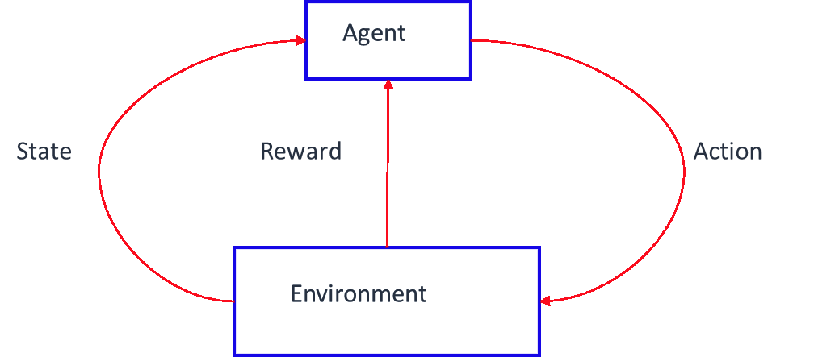

# Reinforcement Learning:   Example

Using reinforcement learning, AlphaGo Zero was able to _learn_ the game of Go from _scratch_.

It _learned_ by _playing against itself_.
- Alpha Go Zero was able to _outperform_ the version of Alpha Go known as Master that has _defeated_ world number one _Ke Jie_.
- It only used black and white stones from the board as input features.
- The agent is composed by a _neural network_.
- AlphaGo Zero played against itself millions of times, and with time and its own creativity, it had managed to find these techniques used by the masters of Go.

::::{.columns}
:::{.column width=40%}

:::
:::{.column width=30%}

:::
:::{.column width=30%}

:::
::::

# What is Artificial Intelligence?

AI is concerned with getting _computers_ to _do tasks_ that would _normally_ require _human intelligence_.  ​

::::{.columns}
:::{.column width=50%}
- AI refers to a broad field of science encompassing _not only_ computer science but _also psychology_, _philosophy_, _linguistics_ and other areas.  ​
:::
:::{.column width=50%}

:::
::::

__Applications:__   ​

- Computer Vision  ​
- Natural language processing (NLP)  ​
- Robotics & Motion  ​
- Planning and optimization  ​
- Knowledge capture

# Artificial Intelligence (AI)


> "AI is the science and engineering of making intelligent machines, especially intelligent computer programs."

# AI: definition and types

_According to the Computer Science view:_ __"Intelligent agents"__ perceiving their environment and taking __actions__ to achieve a __goal__.

_Narrow or Weak AI_ performs some __traditional goals__

* Reasoning, planning, learning, natural language processing, image recognition ...

_Artificial general intelligence (AGI)_, also _called Strong AI_:

* Performs a full range of human abilities
* Some predict it will be 2050 before we can achieve this
* _We are not sure if we will ever understand consciousness_

# Artificial intelligence and the rational agent - 1/2


Agent comes from the Latin "agere" - to do.

- In AI we assume _agents_ are _rational_ and are _expected_ to achieve the _best_ outcome or _best expected_ outcome if there is _uncertainty_. They also act "_autonomously_"!
- _There are other approaches based on human behaviour or human thought but this approach is the most amenable to scientific development._


# Artificial intelligence and the rational agent - 2/2

::::{.columns}
:::{.column width=70%}
__Stuart Russell and Peter Norvig__'s book, _Artificial Intelligence - A Modern Approach_ defines an __agent__

> "For each possible percept sequence, a rational agent should select an action that is expected to maximize its performance measure, given the evidence provided by the percept sequence and whatever built in knowledge the agent has."

* We expect agents to be rational and this depends on _four things_:
* The performance _measure_ that defines the criterion of _success_
* The agent's prior _knowledge_ of the _environment_
* The _actions_ that the agent _can_ perform
* The agent's _percept sequence_ to date
:::
:::{.column width=30%}

:::
::::

# Schematic of AI (the Computer Science view) - 1/2

::::{.columns}
:::{.column width=30%}

:::
:::{.column width=70%}
* __Percept__: the collective term of all the agent's perceptual inputs at any given time (obtained from sensors)
* __Program__ delivers the agent functionality: mapping sensor precept to actuator actions
* __Action__ undertaken by actuators to manipulate the environment
    * _"Learn from experience, adapt, understand and handle abstract concepts, manipulate our environment"._
    * _A program will run on a computing device, improving its performance through learning _
:::
::::

# Agent examples

| Agent Description | Performance Measure | Environment | Actuators | Sensors |
|:-: |:-: |:-: |:-: |:-: |
| __Central heating thermostat__ | Temperature, heating cost | Building, inhabitants, heating system | Inhabitant display, boiler, power | Temperature, keypad, phone, computer |
| __Interactive sales chatbot__ | Number of sales | Customers, sale environment (internet, store, phone) | Robot, display, speaker | Keyboard, microphone, camera, kinesthetic sensors |


# Types of agents

_Reflex agent_: the program selects actions based on the current precept

* simple to understand and program 
* _e.g. central heating overheats, program selects the action to switch off the power_

_Model-based reflex agent_: the agent has a model of the world

* can make up for a lack of sensor (virtual world that doesn't need sensor data)
* program now looks at the percept and updates its own internal world (state)
* program can assess the possible actions and future states and uses reflex agent approach to determine what actions to take
* _e.g. underwater vehicle loses visual sensors (silt - not enough light), continues using 3D mapped geometrical model _

# Types of agents

_Goal-based agents_

* the program needs more than just sensors and an internal world to implement the agent's functionality - it needs a goal
* these programs are more versatile and flexible - can adapt to changes 
* _e.g. autonomous vehicle can choose one of five exits from a motorway, the goal (safest, quickest, most scenic, cheapest, shortest) _

_Utility-based reflex agent_

* Utility is the scientific way economists measure an agent's happiness; it's more versatile than a yes/no happy or unhappy - it measures how useful it is.
* _e.g. Chatbot doctor assesses the efficacy of a treatment based on patient's needs_

# Thanks!