BOLOGNA 11 aprile 2025

 __Data Science__    _panoramica introduttiva_ 

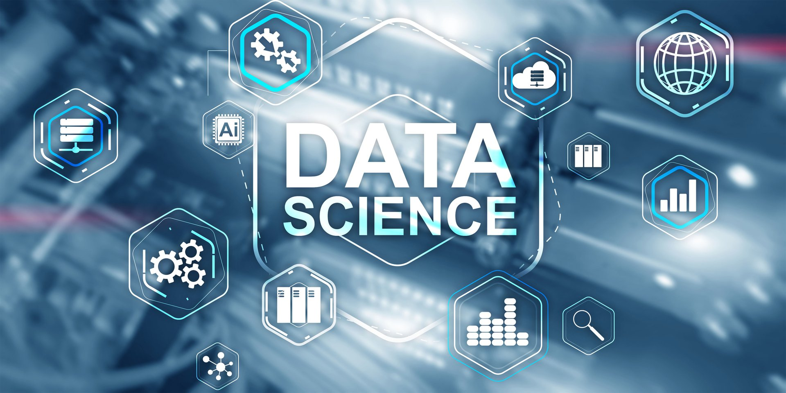

# Doriano Gallozzi

# Participants presentation

# Agenda

* __Introduction__

* __DBMS, Big Data, Cloud solutions __

* __Data Analytics__

* __Data Management and Data Governance__

* __Computer programming__

* __Business Intelligence & Visualization of Data__

* __Statistics & Probability__

* __Machine Learning (ML)__

* __Artificial Intelligence (AI)__  __  __

# Agenda

* __Introduction__

* __DBMS, Big Data, Cloud solutions __

* __Data Analytics__

* __Data Management and Data Governance__

* __Computer programming__

* __Business Intelligence & Visualization of Data__

* __Statistics & Probability__

* __Machine Learning (ML)__

* __Artificial Intelligence (AI)__  __  __

# Why is Data and Data Science Important?

Data has become the   __fuel__   of industries as companies require data to function, grow and improve their businesses

Analysing a large amount of data to derive   __meaningful__     __insights__, with the help of Data Scientists assist companies in making valuable (and rationalized) decisions

__Real__   world   __problems__   can be   __solved__   with Data Science

The number of   __roles__   for Data Scientists has   __grown__   by   __650__  % since 2012.

About   __11.5 Million jobs__     __will__   be   __created by 2026 __  according to the U.S. Bureau of Labor Statistics.

Data Science has   __applications__   in   __several__   fields

Data Science is a very robust field that best fits people who enjoy   __experimentation__   and   __problem-solving__ 

# What is Data Science?

_"Data Science is about _   _extraction_   _, _   _preparation_   _, _   _analysis_   _, _   _visualization_   _, and _   _maintenance_   _ of information. It is a _   _cross-disciplinary_   _ field which uses _   _scientific_   _ _   _methods_   _ and processes to draw _   _insights_   _ from data."_

Client Requirements

__Domain Knowledge__

Highlight important criteria

Easier explanation of technical concepts

Research & Analysis

Statistical Knowledge

Database Languages (SQL, Hadoop)

__Mathematical & Statistical Aptitude__

Machine Learning

__Computer Science__

Data Preprocessing

Designing Methods

Tuning & Fitting the Model

Data Infrastructure

Python, R and other languages

Classification and Regression Models

# Data Science Skills

__Inferential Statistics__

__Descriptive Statistics__

__Linear Algebra__

__Calculus__

__Excel__

__Python__

__R__

__SQL__

__Programming Knowledge__

# Agenda

* __Introduction__

* __DBMS, Big Data, Cloud solutions __

* __Data Analytics__

* __Data Management and Data Governance__

* __Computer programming__

* __Business Intelligence & Visualization of Data__

* __Statistics & Probability__

* __Machine Learning (ML)__

* __Artificial Intelligence (AI)__  __  __

# What is a Database?

Formally, a   __database__   refers to a set of related data and the way it is organized.  _Access_  to this data is usually provided by a " _database_   _management_   _system_ " ( _DBMS_ ) consisting of an integrated set of computer  _software_  that allows users to  _interact_  with one or more databases and provides  _access_  to all of the data contained in the database.

The DBMS provides  _various_   _functions_  that allow entry, storage and retrieval of large quantities of information and provides ways to  _manage_  how that information is organized.

Because of the  _close_   _relationship_  between them, the term   __database__   is often used casually to  _refer_  to  _both_  a  _database_  and the  _DBMS_  used to manipulate it.

---

Definition:
‘A database is an organized collection of data, generally stored and accessed electronically from a computer system.'

Source: https://en.wikipedia.org/wiki/Database

# Evolution of the Database | Original Databases

__Original databases__

Navigational databases such as the   __hierarchical database __  and the   __network database__     were the original systems used to store and manipulate data.

These early systems were   _simple but inflexible_.

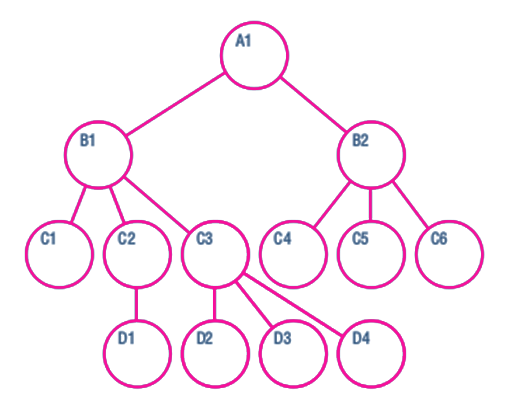

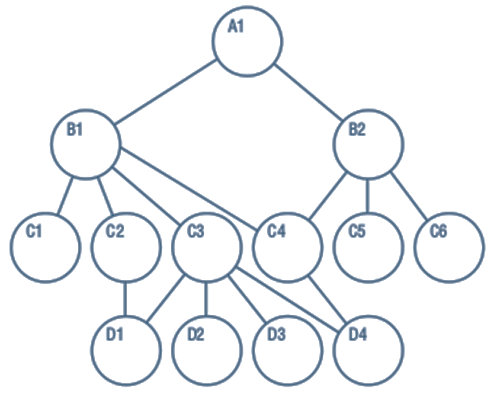

---

Hierarchical database background info: 
https://mariadb.com/kb/en/understanding-the-hierarchical-database-model/"The earliest model was the hierarchical database model, resembling an upside-down tree. Files are related in a parent-child manner, with each parent capable of relating to more than one child, but each child only being related to one parent."

Network database background info: 
https://mariadb.com/kb/en/understanding-the-network-database-model/
"The network database model was a progression from the hierarchical database model and was designed to solve some of that model's problems, specifically the lack of flexibility. Instead of only allowing each child to have one parent, this model allows each child to have multiple parents"

# Evolution of the Database | Relational Databases

__Relational databases__

In the 1980s,   __relational databases__     became popular.

Items in a relational database are organized as a set of   __tables__   with   __columns__   and   __rows__.

The   __relational__       __model__     allows any  _table_  to be  _related_  to any other by means of a  _common_   _field_

Relational database technology  _still provides _ the most efficient and flexible way to access   __structured__       __information__.

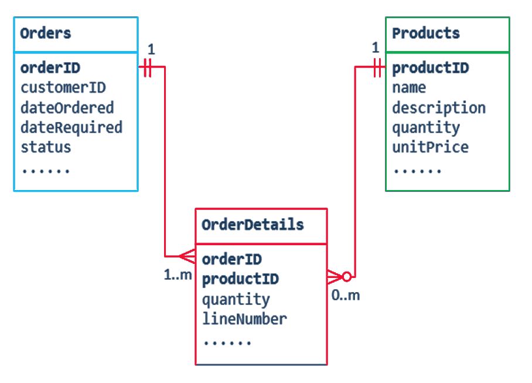

---

A relational database is a digital database based on the relational model of data, as proposed by E. F. Codd in 1970

Relational databases source: 
https://mariadb.com/kb/en/understanding-the-relational-database-model/
Image relational database:https://www3.ntu.edu.sg/home/ehchua/programming/sql/Relational_Database_Design.html

# What is an RDBMS?

A   __software__     system used to   __maintain__     relational databases is a Relational Database Management System or  _RDBMS_.

Widely known Relational Database Management Systems include:

* MySQL

* Oracle

* Microsoft SQL Server

* PostgreSQL

* IBM DB2

* Microsoft Access

There are also   __Cloud data warehouses__, for example:

* Snowflake

* Redshift

# What is SQL?

SQL is an acronym for  _Structured_  _ _  _Query_  _ _  _Language_

SQL is the  _standard_   _language_  for dealing with Relational Databases.

SQL is often  _pronounced_  ‘  __Sequel__  '

SQL  _became_  a  _standard_  of the  _American National Standards Institute_  (  __ANSI__  ) in 1986, and of the International Organization for Standardization (  __ISO__  ) in 1987

Relational databases like MySQL, Oracle and MS SQL Server use ANSI SQL

Syntax of SQL is in   __plain English__ 

# What are tables, rows, fields and columns?

The data in a relational database is stored in database objects called  _tables_. Below an example of the   __Customers__    _table_.

A table consists of   __rows__     (or   __records__   __)__  for every data entry

A row contains values for all the different   __fields__     in the table

A   __column__     contains values for a specific field for all the records in the table

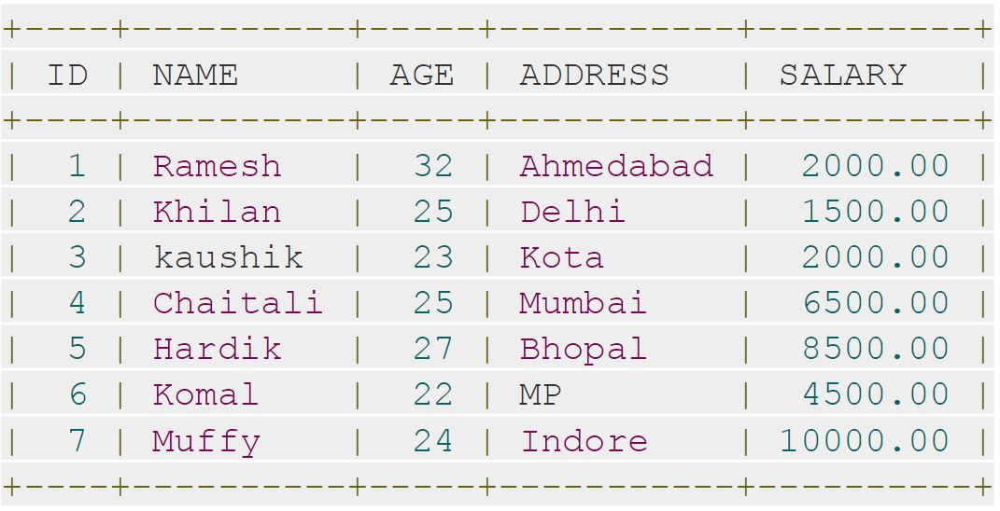

# Evolution of the Database | NoSQL Databases (1/5)

__NoSQL database types__

There are  _four_   _main_  NoSQL database  _types_  today:

 __Key/Value Stores__    

 __Document stores__ 

 __Graph databases__ 

 __Wide Column Stores__ 

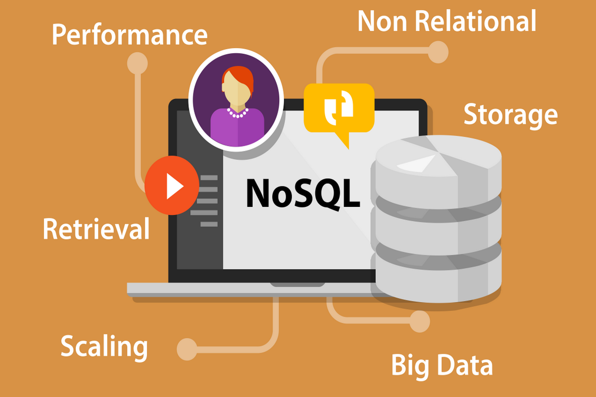

---

Key/Value Stores are the simplest NOSQL database model. They can just store pairs of keys and values and retrieve a value for a given key. Due to the simplicity of the model, they can ensure very high performance and scalability.

Document stores are designed to handle semi-structured data like XML or JSON. The main difference with the key/value stores is that the documents are processed and their internal structures can be used for indexing and other optimization purposes.

In a Graph database, data is represented as a graph in which each node is a record and each arc is a relationship between two nodes. They are optimized to represent complex data models

Wide Column Stores store data in tables, rows, and dynamic columns. They provide a lot of flexibility over relational databases because each row is not required to have the same columns. They are used by popular social networks like Twitter and Facebook to store content produced by their users.

Background - Key value store use cases: 
https://aerospike.com/what-is-a-key-value-store/

Background - Document store use cases: 
https://database.guide/what-is-a-document-store-database/

Background - Graph database use cases: 
https://neo4j.com/use-cases/

Background - Wide Column Store use cases:
Cassandra: https://cassandra.apache.org/case-studies/ 

# Evolution of the Database | NoSQL Databases (2/5)

 _Key/Value Stores _  are the  _simplest_  NOSQL database model. They can just store  _pairs_  of  _keys_  and  _values_  and  _retrieve a value for a given key_. Due to the simplicity of the model, they can ensure very high performance and scalability.

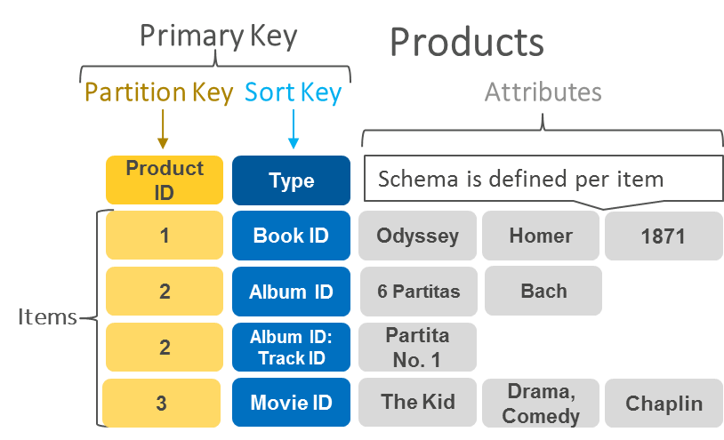

---

Key-value — A key-value data store is a type of database that stores data as a collection of key-value pairs. In this type of data store, each data item is identified by a unique key, and the value associated with that key can be anything, such as a string, number, object, or even another data structure.

# Evolution of the Database | NoSQL Databases (3/5)

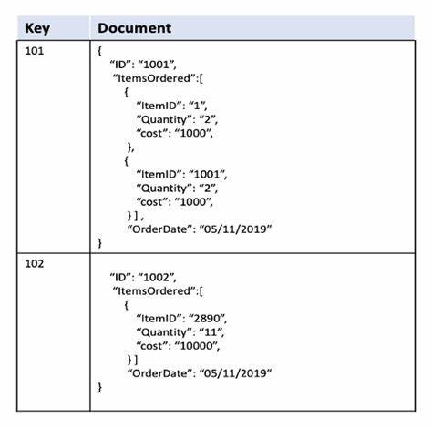

 _Document stores _  are designed to handle  _semi-structured_  data like  _XML_  or  _JSON_. The main difference with the key/value stores is that the documents are processed and their internal structures can be used for indexing and other optimization purposes.

---

Document Database - You can transfer the application code object model directly into a document using several different formats. The most commonly used are JavaScript Object Notation (JSON), Binary JavaScript Object Notation (BSON), and Extensible Markup Language (XML).

# Evolution of the Database | NoSQL Databases (4/5)

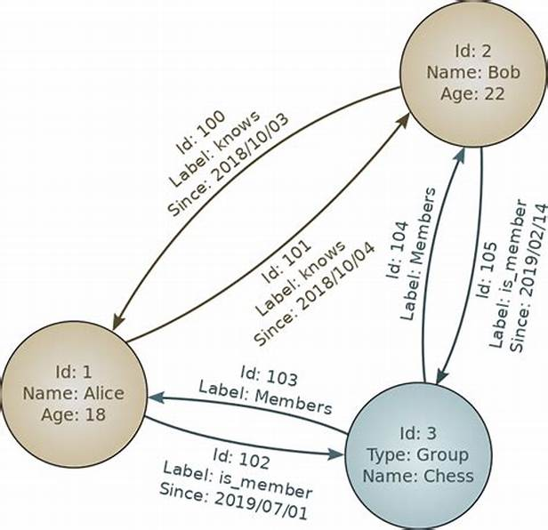

 _Graph database_, data is represented as a  _graph_  in which each  _node_  is a  _record_  and each  _arc_  is a  _relationship_  between two nodes. They are optimized to represent  _complex_  data models

---

Graph — Graph databases are used to store and query highly connected data. Data can be modeled in the form of entities (also referred to as nodes, or vertices) and the relationships between those entities (also referred to as edges). The strength or nature of the relationships also carry significant meaning in graph databases.

Users can then traverse the graph structure by starting at a defined set of nodes or edges and travel across the graph, along defined relationship types or strengths, until they reach some defined condition. Results can be returned in the form of literals, lists, maps, or graph traversal paths. Graph databases provide a set of query languages that contain syntax designed for traversing a graph structure, or matching a certain structural pattern.

The network databases like CODSASYL are still more or less based on a hierarchical data model, thinking in terms of parent-child (or owner-member in CODASYL terminology) relationships. This also means that in network database you can't relate arbitrary records to each other. For example, you may use a graph database to analyze what relationships exist between entities.

# Network Database vs Graph Database

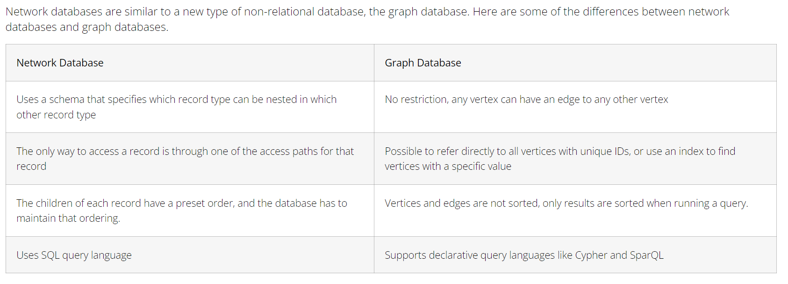

---

Graph — Graph databases are used to store and query highly connected data. Data can be modeled in the form of entities (also referred to as nodes, or vertices) and the relationships between those entities (also referred to as edges). The strength or nature of the relationships also carry significant meaning in graph databases.

Users can then traverse the graph structure by starting at a defined set of nodes or edges and travel across the graph, along defined relationship types or strengths, until they reach some defined condition. Results can be returned in the form of literals, lists, maps, or graph traversal paths. Graph databases provide a set of query languages that contain syntax designed for traversing a graph structure, or matching a certain structural pattern.

The network databases like CODSASYL are still more or less based on a hierarchical data model, thinking in terms of parent-child (or owner-member in CODASYL terminology) relationships. This also means that in network database you can't relate arbitrary records to each other. For example, you may use a graph database to analyze what relationships exist between entities.

# Evolution of the Database | NoSQL Databases (5/5)

 _Wide Column Stores _  store data in  _tables_,  _rows_, and  _dynamic_   _columns_. They provide a lot of  _flexibility_  over relational databases because each row is not required to have the same columns. They are used by popular social networks like  _X_  and  _Facebook_  to store content produced by their users

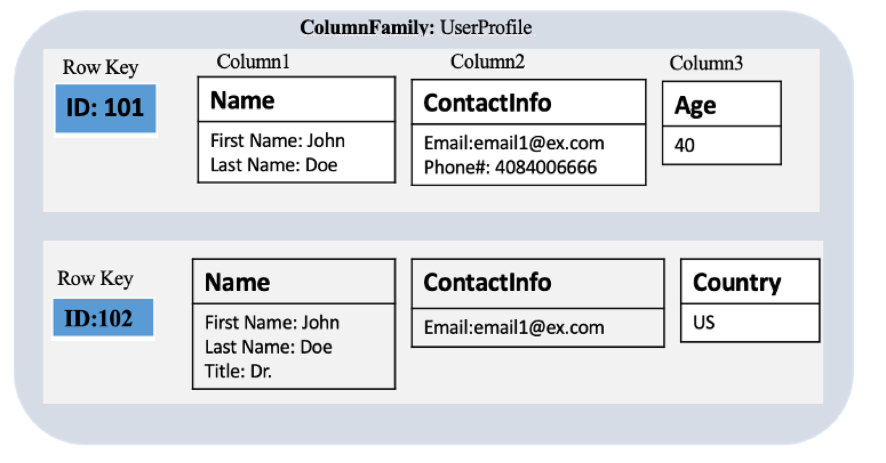

---

Wide-column — A wide column data store is a type of NoSQL database that stores data in columns rather than rows, making it highly scalable and flexible. In a wide column data store, data is organized into column families, which are groups of columns that share the same attributes. Each row in a wide column data store is identified by a unique row key, and the columns in that row are further divided into column names and values.

Unlike traditional relational databases, which have a fixed number of columns and data types, wide column data stores allow for a variable number of columns and support multiple data types. The most significant benefit of having column-oriented databases is that you can store large amounts of data within a single column. This feature allows you to reduce disk resources and the time it takes to retrieve information from it.

# Evolution of the Database | New Developments

__New developments__

Today we have   __Cloud__   databases and   __self-driving__   databases that are creating a  _new_  ground when it comes to how data is  _collected_,  _stored_,  _managed_, and  _utilized_.

 _"_    _The autonomous database uses _    _machine_    _ _    _learning_    _ to _    _automatically_    _ _    _upgrade_    _, _    _patch_    _ and _    _tune_    _ itself while _    _running_    _. Security updates are automated with no downtime required. Machine learning is used to make sure the database consumes less compute and storage thanks to automatic compression of data. The result is a faster, more reliable and cheaper database than the traditional database._    _"_ 

---

Cloud databases: same database types as before, but now in the cloud (Amazon RDS, Azure Databases. Both relational and noSQL.

Self-driving database background info: 
https://markvanrijmenam.medium.com/the-database-of-tomorrow-the-self-driving-autonomous-database-6e51d45778f6

"The autonomous database uses machine learning to automatically upgrade, patch and tune itself while running. Security updates are automated with no downtime required. Machine learning is used to make sure the database consumes less compute and storage thanks to automatic compression of data. The result is a faster, more reliable and cheaper database than the traditional database."

# Explosion of Data

History: Societies were more successful if they were able to store and  _use data_

1970 - 2000: Data grows exponentially, new possibilities to  _store and search _ data on mainframes and later in Relational Databases

2000 - Now: Big Data with  _scalable solutions _ for storage, processing and streaming

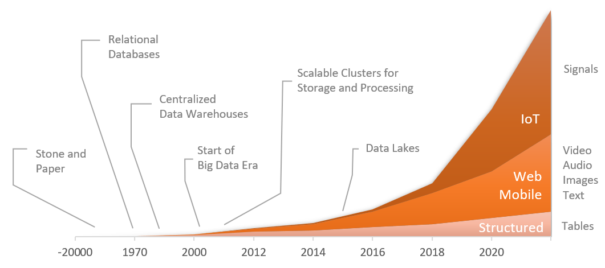

---

Pre-databases from 20000 years ago
Successful societies were able to store and use data
Couldn't handle growth in physical storage
Example: tribespeople (18000 BCE) mark notches into sticks or bones, to keep track of trading activity 
Example: The abacus (C 2400 BCE) The first dedicated device constructed specifically for performing calculations - comes into use in Babylon
Example: The Library of Alexandria (300 BC - 48 AD) The largest collection of data in the ancient world, housing up to perhaps half a million scrolls and covering everything we had learned so far

Databases from 1970s
Data grows exponential, new possibilities to store data on mainframes and in databases
Example: OLTP, OLAP, RDBMS

Big Data from 2000s
Scalable solutions for storage and processing

Data Lakes: storage for maintaining structured and unstructured data

# The Rise of Big Data

From  _2000 to 2012 _ the landscape changed towards Big Data, triggered by exponentially growing data.

_Web, Social & Mobile use:_

 __Google__    started indexing the web

 __Yahoo__,    __Amazon__    and    __eBay__    started analyzing click rates

Mobile GPS data applications

 __Facebook__    connected user profiles into a graph structure

 __Netflix__    network traffic usage and recommendation engine

 _This required _    _not-yet invented approaches _    _for platforms and tools to order and analyze these _    _new data scenarios_    _._ 

---

Early 2000s
- New Data scenarios occurred by increased web/mobile use. Large companies had to find new approaches and storage solutions to deal with these new data types in order to analyze them effectively
- techniques that arrived to analyze data in a decentralized way: MapReduce, Hadoop and BigQuery 

2012 
- Hadoop 1.0 became a mature solution

More recently:
- IoT scenarios contributed to new BigData scenarios with sensor-based internet-enabled devices
- Self-driving cars, like from Tesla, analyze real-time video-capturing of the road/traffic

Image is a printscreen of a google search on 2021-05-04 for: how large is google's page index

# Big Data Landscape 2012

---

The state of Big Data is everchanging and growing over time.
The following sheets illustrate the growth of the Big Data Landscape

Noticeable:
The three top cloud providers (AWS, Azure, GCP) become stronger and more inclusive; more mature and more complete in their services
Hadoop peaked after 2012, but is struggling now to keep up; because there are better alternatives for distributed analytics that can seperate the scaling of storage from the scaling of computation
Since 2012, a flood of new platforms, tools and components have arisen based on the removal of those restrictions. Some came quickly and disappeared just as quickly, some grew and matured steadily. Between 2012 and 2018, the key players in the market changed almost every year. Since 2018, a stabilization has been underway and the large Clouds have reached the point where they can offer a stable and mature landscape that makes traditional value of data (SQL, DWH) and innovation and flexibility (Big Data, AI / ML) available to everyone
These overviews depict a fast growing and ever changing and innovating landscape of tools, platforms and technologies!

Big Data Landscape per year:
2012 https://mattturck.com/a-chart-of-the-big-data-ecosystem-take-2/
2014 https://mattturck.com/the-state-of-big-data-in-2014-a-chart/
2016 https://mattturck.com/big-data-landscape/
2017 https://mattturck.com/bigdata2017/
2018 https://mattturck.com/bigdata2018/
2019 https://mattturck.com/data2019/
2020 https://mattturck.com/data2020/

# Big Data Landscape 2016

---

The state of Big Data is everchanging and growing over time.
The following sheets illustrate the growth of the Big Data Landscape

Noticeable:
the three top cloud providers (AWS, Azure, GCP) become stronger and more inclusive; more mature and more complete in their services
Hadoop peaked after 2012, but is struggling now to keep up; because there are better alternatives for distributed analytics that can seperate the scaling of storage from the scaling of computation
Since 2012, a flood of new platforms, tools and components have arisen based on the removal of those restrictions. Some came quickly and disappeared just as quickly, some grew and matured steadily. Between 2012 and 2018, the key players in the market changed almost every year. Since 2018, a stabilization has been underway and the large Clouds have reached the point where they can offer a stable and mature landscape that makes traditional value of data (SQL, DWH) and innovation and flexibility (Big Data, AI / ML) available to everyone
These overviews depict a fast growing and ever changing and innovating landscape of tools, platforms and technologies!

Big Data Landscape per year:
2012 https://mattturck.com/a-chart-of-the-big-data-ecosystem-take-2/
2014 https://mattturck.com/the-state-of-big-data-in-2014-a-chart/
2016 https://mattturck.com/big-data-landscape/
2017 https://mattturck.com/bigdata2017/
2018 https://mattturck.com/bigdata2018/
2019 https://mattturck.com/data2019/
2020 https://mattturck.com/data2020/

# Big Data Landscape 2020

---

The state of Big Data is everchanging and growing over time.
The following sheets illustrate the growth of the Big Data Landscape

Noticeable:
the three top cloud providers (AWS, Azure, GCP) become stronger and more inclusive; more mature and more complete in their services
Hadoop peaked after 2012, but is struggling now to keep up; because there are better alternatives for distributed analytics that can seperate the scaling of storage from the scaling of computation
Since 2012, a flood of new platforms, tools and components have arisen based on the removal of those restrictions. Some came quickly and disappeared just as quickly, some grew and matured steadily. Between 2012 and 2018, the key players in the market changed almost every year. Since 2018, a stabilization has been underway and the large Clouds have reached the point where they can offer a stable and mature landscape that makes traditional value of data (SQL, DWH) and innovation and flexibility (Big Data, AI / ML) available to everyone
These overviews depict a fast growing and ever changing and innovating landscape of tools, platforms and technologies!

Big Data Landscape per year:
2012 https://mattturck.com/a-chart-of-the-big-data-ecosystem-take-2/
2014 https://mattturck.com/the-state-of-big-data-in-2014-a-chart/
2016 https://mattturck.com/big-data-landscape/
2017 https://mattturck.com/bigdata2017/
2018 https://mattturck.com/bigdata2018/
2019 https://mattturck.com/data2019/
2020 https://mattturck.com/data2020/

# What is Big Data?

__What kind of data does Big Data imply?__

The term implies data of an   __indeterminate—and__   steadily   __increasing—size__   as well as from an   __indeterminate__   number of   __sources__, including data generated by  _employees_,  _customers_,  _partners_,  _machines_,  _logs_,  _databases_, security  _cameras_,  _mobile_   _devices_,  _social_   _media_, and more.

---

Definition:
‘Big data refers to the 21st-century phenomenon of exponential growth of business data, and the challenges that come with it, including holistic collection, storage, management, and analysis of all the data that a business owns or uses.' 

Source: https://www.informatica.com/services-and-training/glossary-of-terms/big-data-definition.html

Scalability: computation and storage scale linearly
Flexibility: no fixed data formats needed
Limitless: no predefined limits on storage and computation
Coping with uncertainty: changes in data formats are supported without issues

# 5 V's of Big Data - 1/3

Big Data is often explained with  _3 or more parameters_.  Big Data Tech is aimed at handling these V's.

_5 V's:_

 __Volume: __   the scale of data

 __Velocity:__    the speed of data

 __Variety: __   the diversity of data

 __Veracity: __   the accuracy of data

 __Value: __   insights gained from data

Along with these V's there are some other issues as    _performance_,    _networking_,    _pre-processing-_    and    _analysis_    techniques. 

Terabytes

Records/Arch

Tables, Files

Distributed

Batch

Real/near-time

Processes

Streams

__5 Vs of Big Data__

Statistical

Events

Correlations

Hypothetical

Structured

Unstructured

Multi-factor

Probabilistic

Linked

Dynamic

Trustworthiness

Authenticity

Origin, Reputation

Availability

Accountability

---

Image: https://www.researchgate.net/figure/5Vs-of-big-data-10_fig1_325103690

5 V's: started with Volume, Velocity and Variety, later also Value and Veracity
Volume
Refers to the size of the data sets that need to be analyzed and processed. 
Example: All credit card transactions on a day within Europe.
Velocity
Refers to the speed with which data is generated. Velocity data flows in from sources like machines, networks, social media, mobile phones etc..
Example: Twitter messages or Facebook posts.
Variety
Big Data comes from a great variety of sources and generally is one out of three types: structured, semi-structured and unstructured data. 
Example: CCTV audio and video files that are generated at various locations in a city.
Veracity
Refers to the quality of the data that is being analyzed. 
Example: Data from a medical experiment or trial.
Value
Refers to the value of the insights gained from data. The bulk of Data having no Value is of no good to the company, unless you turn it into something useful.
Example: turn web-clicks into useful info to improve your webshop and optimize profit
Is this the most important of all Vs??

Data with high volume, high velocity and high variety must be processed with advanced tools (analytics and algorithms) to reveal meaningful information. 

# 5 V's of Big Data - 2/3

 _Volume_ 

Refers to the size of the data sets that need to be analysed and processed.

_Example: All credit card transactions on a day within Europe._

 _Velocity_ 

Refers to the speedwith which data is generated. Velocity data flows in from sources like machines, networks, social media, mobile phones etc.

_Example: Instagram stories or Facebook posts._

 _Variety_ 

Big Data comes from a great variety of sourcesand generally is one out of three types:structured, semi-structured and unstructured data.

_Example: CCTV audio and video files that are generated at various locations in a city._

# 5 V's of Big Data - 3/3

 _Veracity_ 

Refers to the quality of the data that is being analysed.

_Example: Data from a medical experiment or trial._

 _Value_ 

Refers to the value of the insights gained from data. The bulk of Data having no Value is of no good to the company, unless you turn it into something useful.

_Example: turn web-clicks into useful information to improve your e-shop and optimize profit_

# Big Data is also.....

 __Scalable__   with computation and storage, by running parallel jobs on distributed systems

 __Flexible__, so  _potentially any data schema_  fits

 __Limitless__, it (almost) doesn't have limitations

 __Uncertain__, unreliable and changeable

 __Not better than structured data__, it is just an  _alternative_  for other scenarios

 __Stored in a Data Lake__, which can also become a Data Swamp

 __About how you use the data__. It's actually not about the size of your data. Data  _size_  is always  _relative_.

 __Affordable__   compared to  _on-_  _prem_  _ solutions_

 __Horizontally scalable __  instead of   _forklift upgrades_ 

---

forklift upgrades=vertical scalability

In modern terms, a forklift upgrade usually refers to a software change that requires extensive hardware updates or a hardware update that requires all new software. 
Forklift upgrades are most common in organizations with many legacy systems that make new implementations trickier as the surrounding systems age.

A forklift is a powered industrial truck used to lift and move materials over short distances

Flexibility:  
A traditional database is based on a fixed schema that is static in nature. Big data uses a dynamic schema that can include structured as well as unstructured data. The data is stored in a raw form and the schema is applied only when accessing it. For big data analytics, datasets from diverse sources are appended, then functions such as storing, cleansing, distributing, indexing, transforming, searching, accessing, analyzing, and visualizing are performed.

Distributed architecture:  
Big data uses a distributed architecture. 
Computation is distributed among several computers in a network. 
The use of commodity hardware, open-source software, and cloud storage makes big data storage even more economical.  
Once data quality checks and data normalization are conducted, the data is modeled so that it can be stored in a data warehouse.  

Image: https://www.stone-ba.nl/nieuws/big-data-revolutie/

# Cloud Solutions for Big Data

Big Data solutions are   __ __   _Cloud-focused_  :

_Cloud_   is the   _logical_   decision for   _Big Data solutions_.    _On-_    _Prem_    _ just for business cases with heavy security and privacy_ 

All services within    __one Cloud provider__   : Traditional Data solutions and Big Data solutions are    __not separate worlds__    __ __   anymore

Cloud platforms are    __mature__    and Cloud services are    __stable__    and becoming more uniform

---

The cloud logo's represent the Cloud market share:
https://www.statista.com/chart/18819/worldwide-market-share-of-leading-cloud-infrastructure-service-providers/

# Data Lake

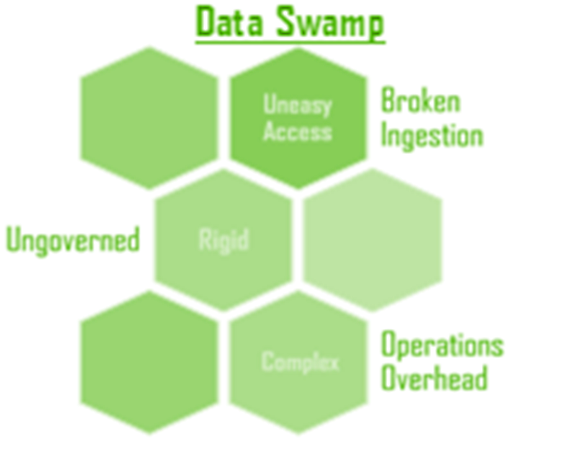

Scalable and no limitations, but at the same time do not just throw data into a big pile.

__Data Lake or Data Swamp? __ ​

Just because  _you can_    _save_     and   _edit_     everything   _doesn't_       _mean_      _you have to_

Data Lakes often   _become_     data   _swamps_ 

Structure and information are there, why not use it?

Why   _keep_       _things_     that have   _no_       _value_?

Or just   _keep_       _everything_?

Saving and processing data is not a capability\!

Everything is possible (cloud and big data) and affordable too, but should you do it all?

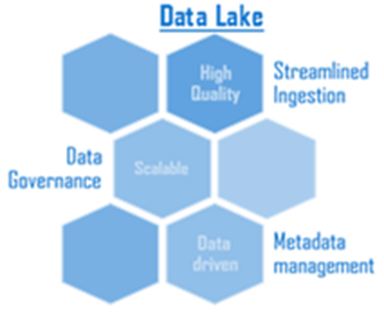

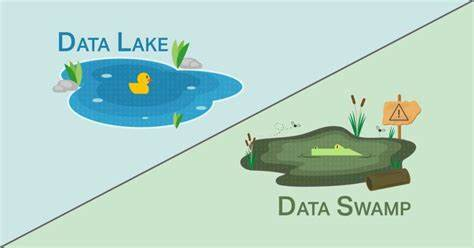

---

Discuss what data you should save when there are no limits 
privacy issues?
Does data become obsolete?
What are mainenance costs of data (keeping meta info up-to-date)

Saving and processing data is not a capability!
You need a business case to create value

Image: https://sbhoracle.wordpress.com/2019/07/13/thinking-to-setup-a-data-lake-for-your-org-lets-read-this/

# Agenda

* __Introduction__

* __DBMS, Big Data, Cloud solutions __

* __Data Analytics__

* __Data Management and Data Governance__

* __Computer programming__

* __Business Intelligence & Visualization of Data__

* __Statistics & Probability__

* __Machine Learning (ML)__

* __Artificial Intelligence (AI)__  __  __

# What is Data Analytics?

Data analytics draws from a range of disciplines — including   __computer__   __ __   __programming__,   __mathematics__, and   __statistics__   — to perform analysis on data in an effort to  _describe_,  _predict_, and  _improve_  performance.

To ensure robust analysis,   __data analytics teams leverage a range of data management techniques__, including data  _mining_, data  _cleansing_, data  _transformation_  and data  _modeling_.

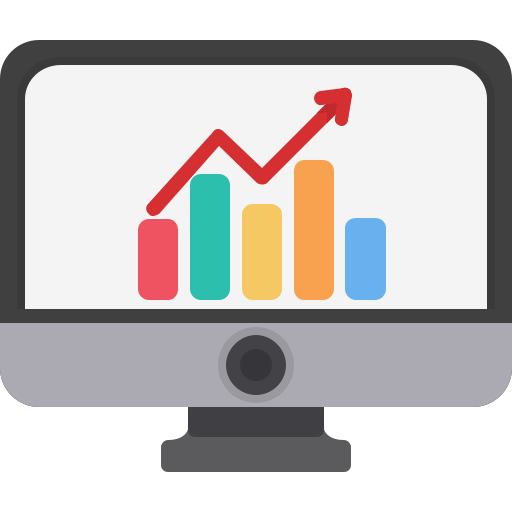

---

Source: https://www.cio.com/article/3606151/what-is-data-analytics-analyzing-and-managing-data-for-decisions.html

Definition:
‘Data analytics is a discipline focused on extracting insights from data. It comprises the processes, tools and techniques of data analysis and management, including the collection, organization, and storage of data.' 

4 Types of data analytics
Descriptive analytics: What has happened and what is happening right now? Descriptive analytics uses historical and current data from multiple sources to describe the present state by identifying trends and patterns. In business analytics, this is the purview of business intelligence (BI).

Diagnostic analytics: Why is it happening? Diagnostic analytics uses data (often generated via descriptive analytics) to discover the factors or reasons for past performance.

Predictive analytics: What is likely to happen in the future? Predictive analytics applies techniques such as statistical modeling, forecasting, and machine learning to the output of descriptive and diagnostic analytics to make predictions about future outcomes. Predictive analytics is often considered a type of "advanced analytics," and frequently depends on machine learning and/or deep learning.

Prescriptive analytics: What do we need to do? Prescriptive analytics is a type of advanced analytics that involves the application of testing and other techniques to recommend specific solutions that will deliver desired outcomes. In business, predictive analytics uses machine learning, business rules, and algorithms.

# Data Analytics | Real Life Examples

| Company | Use of Data and Result |
| :-: | :-: |
| Netflix | By analyzing data the company has successfully managed to grow, be receptive of  _what_   _viewers_   _want_  and to produce widely acclaimed hits |
| Google | Utilised people  _analytics_  to create a better workforce |
| Coca-Cola | Leverages the power of  _image_   _recognition_  technology and data analytics to specifically  _target_   _users_  based on  _photos_  user  _share_  socially and create personalized ads |
| DDS Bank | Harnesses AI and analytics to provide  _customers_  with  _hyper-personalized_   _insights_  and  _recommendations_  in order make better financial decisions |
| UBER | Uses analytics to provide faster and more  _efficient_   _ride_  with data |

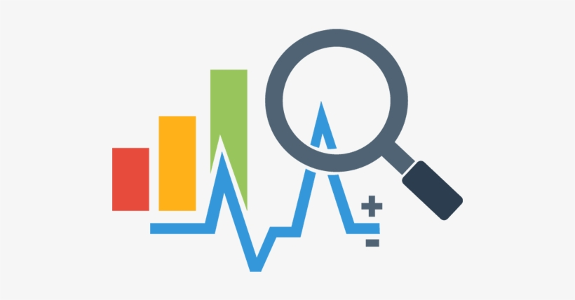

---

Next to DDS Bank, BBVA (bank) is one of the front runners in data analytics

# Data Analytics | Benefits

 __Data Analytics __  enables organizations to optimize performances to  _improve on company goals _

The ultimate company goal is to   __make a profit - __  divided into  _subgoals_  like   _growing_     _revenue_   and   _reducing_     _costs_ 

Companies that make use of Data Analytics have a higher chance to succeed/survive

 _Practical Data Analytics benefits:_ 

Decisions or decision support that results in  _better_   _outcomes _

Finding  _patterns_  and  _trends_  that otherwise wouldn't be identified

Able to make  _predictions_  and  _recommendations_  that improve the companies' current performance

Higher quality and a more effective  _presentation_  of derived information

# Common Data Analytics Tools and Techniques

Distributed Computing

Machine Learning

Data

Warehousing

Business Intelligence

Results

Presentation

# Types of Data Analytics - 1/2

__Descriptive__

_What_  happened?

Decision or Insight

__Diagnostic__

_Why _ did it happen?

__Predictive__

Based on what we know, What will happen?

__Decision Support__

__Prescriptive__

Now that I know, what do I do?

__Decision Automation__

_Adapted from Gartner Report July 2015_

---

Image: https://www.healthcatalyst.com/closed-loop-analytics-method-healthcare-data-insights

Types of data analytics​
There are four types of analytics:​
Descriptive analytics: What has happened and what is happening right now? Descriptive analytics uses historical and current data from multiple sources to describe the present state by identifying trends and patterns. In business analytics, this is the purview of business intelligence (BI).​
Diagnostic analytics: Why is it happening? Diagnostic analytics uses data (often generated via descriptive analytics) to discover the factors or reasons for past performance.​
Predictive analytics: What is likely to happen in the future? Predictive analytics applies techniques such as statistical modeling, forecasting, and machine learning to the output of descriptive and diagnostic analytics to make predictions about future outcomes. Predictive analytics is often considered a type of "advanced analytics," and frequently depends on machine learning and/or deep learning.​
Prescriptive analytics: What do we need to do? Prescriptive analytics is a type of advanced analytics that involves the application of testing and other techniques to recommend specific solutions that will deliver desired outcomes. In business, predictive analytics uses machine learning, business rules, and algorithms.

# Types of Data Analytics - 2/2

 __There are four types of analytics:__    __​__ 

 _Descriptive analytics_   :    _What has happened and what is happening right now_? Descriptive analytics uses historical and current data from multiple sources to    _describe the present state by identifying trends and patterns_. In business analytics, this is the purview of Business Intelligence (BI)

 _Diagnostic analytics_   :    _Why is it happening_? Diagnostic analytics uses data (often generated via descriptive analytics) to discover the    _factors or reasons for past performance_.  ​

 _Predictive analytics_   :    _What is likely to happen in the future_? Predictive analytics applies techniques such as statistical   modeling, forecasting, and machine learning to the output of descriptive and diagnostic analytics to make predictions about future outcomes. Predictive analytics is often considered a type of "advanced analytics," and frequently depends on machine learning and/or deep learning.  ​

 _Prescriptive analytics_   :    _What do we need to do? _   Prescriptive analytics is a type of advanced analytics that involves the application of testing and other techniques to recommend specific solutions that will deliver desired outcomes. In business, predictive analytics uses machine learning, business rules, and algorithms.

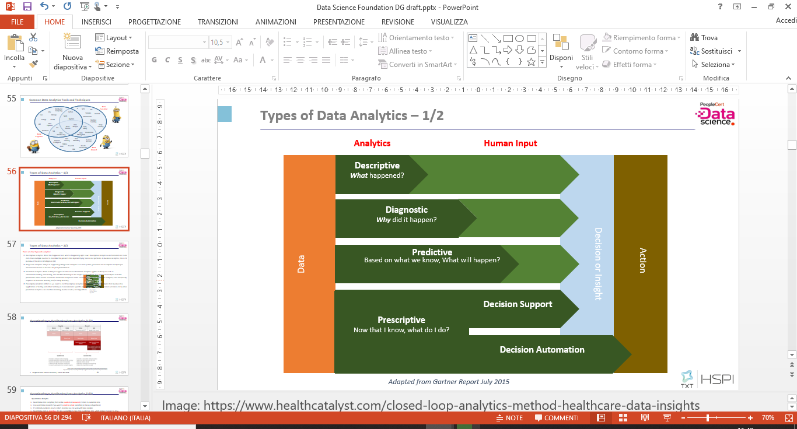

---

Purview = scope

Image: https://www.healthcatalyst.com/closed-loop-analytics-method-healthcare-data-insights

Types of data analytics​
There are four types of analytics:​
Descriptive analytics: What has happened and what is happening right now? Descriptive analytics uses historical and current data from multiple sources to describe the present state by identifying trends and patterns. In business analytics, this is the purview of business intelligence (BI).​
Diagnostic analytics: Why is it happening? Diagnostic analytics uses data (often generated via descriptive analytics) to discover the factors or reasons for past performance.​
Predictive analytics: What is likely to happen in the future? Predictive analytics applies techniques such as statistical modeling, forecasting, and machine learning to the output of descriptive and diagnostic analytics to make predictions about future outcomes. Predictive analytics is often considered a type of "advanced analytics," and frequently depends on machine learning and/or deep learning.​
Prescriptive analytics: What do we need to do? Prescriptive analytics is a type of advanced analytics that involves the application of testing and other techniques to recommend specific solutions that will deliver desired outcomes. In business, predictive analytics uses machine learning, business rules, and algorithms.

# Quantitative vs Qualitative Data Analytics

 _NOIR:_ 

 _Nominal_    scale: A scale used to label variables that have    _no quantitative values_.

 _Ordinal_    scale: A scale used to label variables that have    _naturally occurring orders_, but    _no quantifiable difference_    between values.

 _Interval_    scale: A scale used to label variables that have a    _natural order_    and a    _quantifiable difference_    between values, but    _no "true zero" value._ 

 _Ratio_    scale: A scale used to label variables that have a    _natural order_, a    _quantifiable difference_    between values, and a    _"true zero" value_.  E.g.    _zero degrees _   Celsius is still a temperature, 0   metres   is nothing

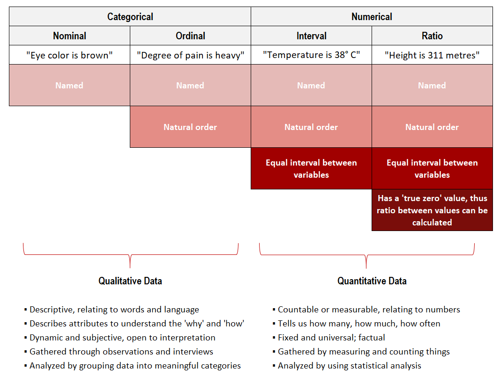

---

NOIR: measurement scales
Nominal scale: A scale used to label variables that have no quantitative values.
Ordinal scale: A scale used to label variables that have naturally occurring orders, but no quantifiable difference between values.
Interval scale: A scale used to label variables that have a natural order and a quantifiable difference between values, but no "true zero" value.
Ratio scale: A scale used to label variables that have a natural order, a quantifiable difference between values, and a "true zero" value.  E.g. zero degrees Celsius is still a temperature, 0 metres is nothing

Image based on:
https://www.statology.org/levels-of-measurement-nominal-ordinal-interval-and-ratio/
https://careerfoundry.com/en/blog/data-analytics/difference-between-quantitative-and-qualitative-data/

# Agenda

* __Introduction__

* __DBMS, Big Data, Cloud solutions __

* __Data Analytics__

* __Data Management and Data Governance__

* __Computer programming__

* __Business Intelligence & Visualization of Data__

* __Statistics & Probability__

* __Machine Learning (ML)__

* __Artificial Intelligence (AI)__  __  __

# What is Data Management? - (1/2)

Having data and using it means it    _needs_    to be    _managed_. 

The    _Data Management Body of Knowledge _   (DMBOK) model defines    _how_    to    _manage_       _data_    in a professional organisation. 

DAMA-DMBOK represents data management in the form of    _11_       _Knowledge_       _Areas_, represented on the famous DAMA Wheel.   At the    _heart_    of data management is    __Data Governance__.

---

Source: book "DAMA-DMBOK: Data Management Body of Knowledge"

# What is Data Governance?

_Data governance is a system for defining _

 _who_   _ within an organization has _  _authority_  _ and _  _control_  _ over data assets _

 _how_   _ those data assets may be _  _used_  _. _

_It encompasses the _   _people_   _, _   _processes_   _, and _   _technologies_   _ _   _required_   _ to _   _manage_   _ and _   _protect_   _ data assets_  _._

---

Data governance is a system for defining who within an organization has authority and control over data assets and how those data assets may be used. It encompasses the people, processes, and technologies required to manage and protect data assets.

Source: https://www.imperva.com/learn/data-security/data-governance/

# Goals of Data Governance

Define, approve and communicate    __data__       __strategies__, policies, standards, architecture and metrics (KPIs)  ​

Follow and enforce    __compliance__    with law, policies, standards, architecture and procedures

Sponsor, follow and control    __delivery__    of data management    __projects__    and    __services__   ​

 __Manage__    and    __solve__    data related    __issues__ 

Understand and advocate    __importance__    and    __value__    of    __data__    sets

# Topics Closely Related to Data Governance

Four examples of    _topics_       _closely_       _related_    to    _data_       _governance_    are:

*  _Data stewardship _   - a    __functional__       __role__    in data management and governance, with responsibility for    __ensuring__    that data    __policies__    and    __standards__       __turn__    into    __practice__    within the steward's domain

*  _Data quality _   - a    __measure__    of the    __condition__    of data based on factors such as    _accuracy_,    _completeness_,    _consistency_,    _reliability_    and whether it's up to date

*  _Master data management _   - a    __discipline__    in which    __business__    and    __IT__       __work__       __together__    to ensure the uniformity, accuracy, stewardship, semantic consistency and accountability of the enterprise's official shared master data assets

*  _GDPR_    - the    __biggest__       __data__       __privacy__       __use__       __case__    in Data Governance of recent years

---

Data stewardship is a functional role in data management and governance, with responsibility for ensuring that data policies and standards turn into practice within the steward's domain. Data stewards assist the enterprise in leveraging domain data assets to full capacity.

Data quality is a measure of the condition of data based on factors such as accuracy, completeness, consistency, reliability and whether it's up to date. Measuring data quality levels can help organizations identify data errors that need to be resolved and assess whether the data in their IT systems is fit to serve its intended purpose.

Master data management is a discipline in which business and IT work together to ensure the uniformity, accuracy, stewardship, semantic consistency and accountability of the enterprise's official shared master data assets

GDPR is the biggest data privacy use case in Data Governance of recent years

https://www.dnb.com/perspectives/master-data/6-key-responsibilities-of-data-stewards.html
https://searchdatamanagement.techtarget.com/definition/data-quality
https://en.wikipedia.org/wiki/Master_data_management

# GDPR - what is?

 _What is GDPR? _ 

 _"_    _Regulation on the protection of natural persons with regard to the processing of personal data and on the free movement of such data, and repealing Directive 95/46/EC (General Data Protection Regulation)_    _"_ 

The General Data Protection Regulation is the    __toughest__       __privacy__    and    __security__       __law__    in the    __world__       __replacing__      national data protection laws of    __all__       __EU__       __member__       __states__.

Though it was drafted and passed by the European Union (EU), it   also has    __international __   reach -    __applying __   to    __any organization __   that    __processes __   data of    __EU __   data subjects. 

The regulation was    __put __   into    __effect __   on    __May 25, 2018__.   Fines for non-compliance will increase substantially up to a maximum fine of   € 20 million or 4% of global annual sales, whichever is higher

---

Toughest = pr "dòuest", la più robusta

# GDPR - why?

 _Why GDPR?_ 

No    _single_    set of rules in EU

Uncontrolled    _collection_    and    _storage_    of personal data

Inability to    _withdraw_    from direct marketing

No    _control_    over provided consent

 _Lack_    of procedures for data    _accuracy_ 

 _GDPR has fundamentally changed the way companies must manage personal data_ 

GDPR IS ABOUT GIVING    _CONTROL_    OVER    _PERSONAL_    DATA BACK TO    _PEOPLE_ 

# GDPR - personal data

_Personal data_

 __Article 4(1)__     - "Any information relating to an   __identified__   or   __identifiable__   natural person ("data subject"); an   __identifiable person__     is one who can be identified, directly or indirectly, in particular   __by reference to an identifier__     such as a  _name_, an  _identification_  number,  _location_  data, online identifier or to one or more factors specific to the physical, physiological, genetic, mental, economic, cultural or social identity of that person."

 __Examples:__ 

Name

Age

Address

IP address

# GDPR - sensitive data

_SENSITIVE Personal data_

 __Article 9(1)__   __ - __ "Sensitive Personal Data" are personal data, revealing   __racial__   or   __ethnic__   origin,   __political__     __opinions__,   __religious__   or   __philosophical__   beliefs, trade-union membership;   __DATA CONCERNING HEALTH __  (Art.4(15)) or sex life and sexual orientation;   __GENETIC__   __ __   __DATA __  (Art.4(13)) or   __BIOMETRIC DATA__   __ __ (Art.4(14)). Data relating to criminal offences and convictions are addressed separately (as criminal law lies outside the EU's legislative competence).

 __Examples:__ 

* Religion

* Political sympathies

* Race

* DNA data

* History of illnesses

# GDPR Key Principles

__DATA PROTECTION OFFICER__

__PRIVACY BY DESIGN__

__PURPOSE OF DATA COLLECTION__

__DATA MINIMIZATION__

__RIGHT TO BE FORGOTTEN__

__IP ADDRESS IS PERSONAL DATA__

__CONSENT ON DATA COLLECTION AND USAGE__

__DATA PORTABILITY__

__FINES FOR NON-COMPLIANCE INCREASE__

__72 HOURS DATA BREACH REPORTING PERIOD__

# GDPR | Data Protection Officer

__DATA PROTECTION OFFICER__

__PRIVACY BY DESIGN__

Data    __controllers__    are defined as    __organizations__    who    __acquire__    EU residents' data

Data    __processors__    identified as those that    __manage__,    __modify__,    __store__    or    __analyze__    the data collected on behalf of the controllers

__PURPOSE OF DATA COLLECTION__

__DATA MINIMIZATION__

__RIGHT TO BE FORGOTTEN__

__IP ADDRESS IS PERSONAL DATA__

 __DPO__ 

To    _inform_    and    _advise_    the    __controller__    or the    __processor__    and the employees who are     processing personal data of their    _obligations_    pursuant to this Regulation;

To    _monitor_       _compliance_    with this Regulation, including the assignment of responsibilities, awareness- raising and training of staff involved in the processing operations, and the related audits;

To provide    _advice_    where requested as regards the data protection impact assessment and monitor its performance pursuant to Article 35;

To    _cooperate_    with the supervisory    _authority_    (the ICO in the UK);

To act as the    _contact_       _point_    for the supervisory authority on issues related to the processing of personal data

__CONSENT ON DATA COLLECTION AND USAGE__

__DATA PORTABILITY__

__FINES FOR NON-COMPLIANCE INCREASE__

__72 HOURS DATA BREACH REPORTING PERIOD__

---

Le principali figure protagoniste del trattamento dei dati personali, previste dal nuovo Regolamento UE 2016/679 o GDPR (General Data Protection Regulation), sono il Titolare de trattamento (o "Data Controller") e il Responsabile del trattamento (o "Data Processor").

Per fare un esempio pratico si pensi alla situazione in cui un'azienda (ossia il titolare del trattamento) affidi la gestione dell'invio di email marketing con i dati dei suoi clienti (ossia gli interessati) ad un'altra azienda (ossia il responsabile del trattamento). A volte poi nello stesso processo possono essere coinvolti più soggetti che prendono il ruolo di responsabile del trattamento (ritornando all'esempio di prima, il caso in cui l'invio delle email marketing sia fatto con un software gestito da una software house esterna, la quale diventa in questo processo anche essa stessa un altro responsabile del trattamento. E così via...).

# Esempio

---

Per fare un esempio pratico si pensi alla situazione in cui un'azienda (ossia il titolare del trattamento) affidi la gestione dell'invio di email marketing con i dati dei suoi clienti (ossia gli interessati) ad un'altra azienda (ossia il responsabile del trattamento). A volte poi nello stesso processo possono essere coinvolti più soggetti che prendono il ruolo di responsabile del trattamento (ritornando all'esempio di prima, il caso in cui l'invio delle email marketing sia fatto con un software gestito da una software house esterna, la quale diventa in questo processo anche essa stessa un altro responsabile del trattamento. E così via...).

# Agenda

* __Introduction__

* __DBMS, Big Data, Cloud solutions __

* __Data Analytics__

* __Data Management and Data Governance__

* __Computer programming__

* __Business Intelligence & Visualization of Data__

* __Statistics & Probability__

* __Machine Learning (ML)__

* __Artificial Intelligence (AI)__  __  __

# Software

Computer hardware and software require each other, and neither can be realistically used on its own

 _Computer software_   _, or simply _   _software_   _, is that part of a computer system that consists of encoded information or computer instructions_

A collection of computer programs, libraries and related data are also referred to as software

---

Definition:
Computer software, or simply software, is that part of a computer system that consists of encoded information or computer instructions
Software is a collection of programs and data that tell a computer how to perform specific tasks. Software often includes associated software documentation.[1] This is in contrast to hardware, from which the system is built and which actually performs the work.

# Computer Program

A computer   __executes__   the program's instructions in a   __central__     __processing__     __unit__   (CPU)

A computer program is usually   __written__   by a computer programmer in a   __programming__     __language__ 

From the program in its   __human-readable__   form of   __source__   code, a compiler can derive   __machine__   code

Alternatively, a computer program may be executed with the aid of an   __interpreter__ 

---

Definition:
A computer program is a collection of instructions that performs a specific task when executed by a computer

# Introduction to Programming

Why do you need  _programming_   _skills_  for DS, DA, AI and ML?

* All of them  _require_  important  _computer_   _power_

* In order to  _communicate_  with a  _computer_, a  _language_  is  _needed_

*  _Depending on the goal, you might choose _    _one_    _ _    _programming language or another_ 

Two languages dominate in these fields:

*  _Python_ 

    * General-purpose programming language having multiple data science libraries along with rapid prototyping.

*  _R_ 

    * Language for statistical analysis and visualization.

# Python vs R for Data Science | At a Glance

| __Parameter__ | R | __Python__ |
| :-: | :-: | :-: |
| __Objective__ | __Data analysis and statistics__ | Deployment and production |
| __Primary Users__ | Scholar and R&D | Programmers and developers |
| __Flexibility__ | Easy to use available libraries | Easy to construct new models from scratch. I.e., matrix computation and optimization |
| __Learning curve__ | Difficult at the beginning | Linear and smooth |
| __Popularity of Programming Language | Percentage change__ | 4.04% in 20224.23% in 2018 | 28.52% in 202221.69% in 2018 |
| __Integration__ | Run locally | Well-integrated with app |
| __Task__ | Easy to get primary results | Good to deploy algorithm |
| __Database size__ | Handle huge sizes | Handle huge sizes |
| __IDE__ | Rstudio | Spyder, Jupyter Notebook |
| __Important Packages and library__ | tidyverse, ggplot2, caret, zoo | pandas, scipy, scikit-learn, TensorFlow, pycaret |
| __Disadvantages__ | Steep learning curve and dependencies between libraries | Not as many libraries as R |
| __Advantages__ | __Graphs are made to talk. R makes it beautiful__  __Large catalog for data analysis__  __GitHub interface__  __RMarkdown__  __Shiny__ | __Jupyter__  __ notebook: Notebooks help to share data with colleagues__  __Mathematical computation__  __Deployment__  __Code Readability__  __Speed__  __Function in Python__ |

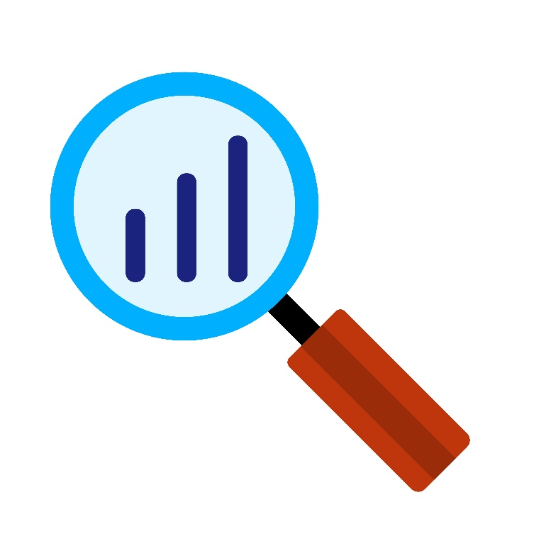

---

Source: https://www.guru99.com/r-vs-python.html

Mention that for Python the most common editors now are: VSCode and PyCharm

# Agenda

* __Introduction__

* __DBMS, Big Data, Cloud solutions __

* __Data Analytics__

* __Data Management and Data Governance__

* __Computer programming__

* __Business Intelligence & Visualization of Data__

* __Statistics & Probability__

* __Machine Learning (ML)__

* __Artificial Intelligence (AI)__  __  __

# What is Data Warehouse?

A    __Data Warehouse__      (DWH) is a system that    _extracts_    from    _operational_    systems and external    __data sources__      within an organization for    __data analysis__      and    __reporting__. Current and historical data is    __transformed__    towards a    __semantic__    __ __    __data model__. This central repository provides users    __decision support__      information, which is difficult to access or present in the traditional operational systems.

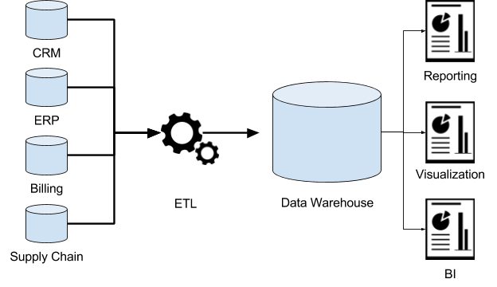

---

Components of a data warehouse are: 
Production data sources like CRM, ERP, Billing, flat files 
Data extraction and conversion (ETL or ELT). Extract-Transform-Load (ETL) data. But nowadays ELT is recommended, so all the untransformed data is saved first, which gives more flexibility later. 
Data warehouse database management system 
Data warehouse administration 
Business intelligence (BI) tools like Power BI, Qlik Sense, Tableau, Looker 

Types of semantic data models are:  
Inmon, Kimball, DataVault 
They make use of terms like Facts, Dimensions, Start schema 
This can be realized by SQL 

DWH related architectures: 
Data mart: subset of DWH for specific business area 
Data lake: a repository for raw (semi/un)structured data 
Data lakehouse: DWH and data lake combined 

# A brief history of Business Intelligence

The term Business Intelligence came to widespread use in the late 1990s. It is often credited to    _Howard _    _Dresner_    _ _   (later a    __Gartner__       __analyst__   ), who in    __1989__    used the term to describe    _"concepts and methods to improve business decision making by using fact-based support systems" _ 

In 1865 Richard Millar Devens presented the phrase   __‘Business Intelligence' __  (BI) in the   Cyclopaedia   of  Commercial and Business Anecdotes. 

He was using it to describe how    __Sir __    _Henry _    _Furnese_, a banker, profited from information by    _gathering_    and    _acting_    on it before his    _competition_. 

---

https://1-answer.com/a-brief-history-of-business-intelligence/

The term Business Intelligence came to widespread use in the late 1990s. It is often credited to Howard Dresner (later a Gartner analyst), who in 1989 used the term to describe "concepts and methods to improve business decision making by using fact-based support systems

In 1865 Richard Millar Devens presented the phrase ‘Business Intelligence' (BI) in the Cyclopaedia of 
Commercial and Business Anecdotes. He was using it to describe how Sir Henry Furnese, a banker, profited from information by gathering and acting on it before his competition.

This is an anecdote that is symbolic for the purpose of BI 
https://en.wikipedia.org/wiki/Business_intelligence#History 

The earliest known use of the term business intelligence is in Richard Millar Devens' Cyclopædia of Commercial and Business Anecdotes (1865). Devens used the term to describe how the banker Sir Henry Furnese gained profit by receiving and acting upon information about his environment, prior to his competitors:
Throughout Holland, Flanders, France, and Germany, he maintained a complete and perfect train of business intelligence. The news of the many battles fought was thus received first by him, and the fall of Namur added to his profits, owing to his early receipt of the news.
— Devens, p. 210

About the illustration: Advantage was especially on getting (long-distance) information sooner than your competitor, so an important role for stagecoaches and postmen

# What is Business Intelligence?

Business Intelligence (BI) turns    __data__    into    __actionable__       __business__       __insights__. 

BI is the continuous process by which organizations    __collect__,    __register__    and    __analyze__    data in a    __targeted__    manner and    __apply__    the resulting information and knowledge in    __decision-making__       __processes__    to    __improve__    the    __performance__    of the organization. 

This requires: 

*  _Data_       _Warehousing_    with    _Data_       _Extraction_    and    _Data_       _Modelling_    

*  _BI_       _tooling_    for Analytics and Presentation 

*  _Business_    and    _Technical_    acumen 

---

Data Extraction and Data modelling - see previous DWH slide 
BI tooling - for analytics, dashboards and reports 
Business and technical acumen - understand the business and implement this knowledge 

# Business Intelligence Trends

 _Data governance _   - Better data management to ensure data quality, integrity, security

 _Self-service B_    _I_    - More options to    _analyze_    and    _visualize_    data for the end-user 

 _Real-time analytics_    - Live dashboards,    _no more waiting_    

 _Embedded BI _   - Better adoption when data analytics occur    _within_    a    _user's_       _natural_       _workflow_    ->    _projects_ 

 _SaaS BI_    -  More flexibility and    _access_    to your data in the cloud,    _from_       _any_       _device_    

---

Data governance: Better data management to ensure data quality, integrity, security 
Self-service BI: More options to analyze and visualize data for the end-user 
Real-time analytics: Live dashboards, no more waiting 
Embedded BI: Better adoption when data analytics occur within a user's natural workflow 
SaaS BI: More flexibility and access to your data in the cloud, from any device 

# What is Data Visualization?

In the world of Big Data, data   __visualization__   tools and technologies are   __essential__   to   __analyze__     __massive__     __amounts__   of information and make   __data-driven decisions__.  

Data visualization helps to tell stories by curating data into a form easier to understand, highlighting the   __trends__     and   __outliers__.

Data visualization can also   __unlock the ability __  of   __less__     __technical__   users to explore and interact with data

 _A good visualization _    _tells a story_    _, _    _removing_    _ the _    _noise_    _ from data and _    _highlighting_    _ the _    _useful_    _ information._ 

---

Outliers = anomalie
Source: https://www.tableau.com/learn/articles/data-visualization

Definition:
‘Data visualization is the graphical representation of information and data. By using visual elements like charts, graphs, and maps, data visualization tools provide an accessible way to see and understand trends, outliers, and patterns in data.'

# The Power of Visuals (1/4)

 _A _   _picture_   _ tells more than a thousand words. A _   _chart_   _ tells more than a million data points_ 

__Human Vision__

Humans are visual by    __Nature__ 

 __90__    percent of information transmitted to the brain is    __visual__ 

 __65__    percent of the population are visual learners,    __graphics__    are    __key__    to    __engaging__    employees

The human brain processes    __Visual__      data    _60.000 times_    better than    __Textual__      data

---

Understand human eye perception and what human vision understands:

A picture tells more than a thousand words
A chart tells more than a million data points

Facts from http://visualteachingalliance.com/:
Fact: Approximately 65 percent of the population are visual learners. - Mind Tools, 1998 
Fact: Although only 10 percent of secondary students are auditory learners, 80 percent of instruction is delivered orally. - University of Illinois Extension, 2009 
Fact: The brain processes visual information 60,000 faster than text. - 3M Corporation, 2001 
Fact: 90 percent of information that comes to the brain is visual. - Hyerle, 2000 
Fact: 40 percent of all nerve fibers connected to the brain are linked to the retina. - Jensen, 1996 
Fact: Visual aids in the classroom improve learning by up to 400 percent. - 3M Corporation, 2001 
Fact: People can remember the content of 2500 pictures with over 90 percent accuracy 72 hours after looking at them for only 10 seconds.  A year later participants had 63 percent recall of those same images. With traditional lecture format delivery, students only remember 10 percent of the material 72 hours later. - Crockett, 2010 
Fact: A good infographic is worth a thousand words. 
Fact: Our eyes can register 36,000 visual messages per hour. - Jensen, 1996 
Fact: It only takes about 1/4 second for the human brain to process and attach meaning to a symbol. By comparison, it takes us an average of 6 seconds to read 20-25 words.- Thorpe, S., Fize, D. & Marlot, C. (1996) 
Fact: Ideas presented graphically are easier to comprehend and remember than those presented as words. -  Kliegl, R., Smith, J., Heckhausen, J. & Baltes, P.B. (1987) 
Fact: Visual Literacy is the ability to encode (create a visual language) & decode (understand a visual language). 
Fact: Students who are twice exceptional (2e) are often strong visual learners.

Image: https://blog.eikontechnology.com/solusi-meningkatkan-kinerja-bisnis-dengan-microsoft-excel-365/

# The Power of Visuals (2/4)

__Visual Deception - Escher__

---

Deception = inganno

Escher was a master in visual deception

Link: https://www.art-madrid.com/en/post/visual-paradoxes-for-the-senses 
https://en.wikipedia.org/wiki/Relativity_(M._C._Escher)

# The Power of Visuals (3/4)

__Visual Deception - different feeling of interpretation__

---

Assi y hanno una scala differente, e ciò porta a una diversa "percezione" della realtà

What's wrong?
same data, same axes  different scale of axis  different 'feeling' and interpretation

Link: https://heap.io/blog/data-stories/how-to-lie-with-data-visualization 

# The Power of Visuals (4/4)

__Visual Deception - __  an   __upside down Y-axes __ with descending (instead of ascending) values to the top might for a moment give the   _wrong_   impression that the ‘Stand your ground law' was   _positive_   in relation to gun deaths

---

Dopo che la Florida ha approvato la legittima difesa le morti AUMENTANO anzichè diminuire (come potrebbe sembrare perchè la curva scende)

A stand-your-ground law, sometimes called a "line in the sand" or "no duty to retreat" law, provides that people may use deadly force when they reasonably believe it to be necessary to defend against certain violent crimes (right of self-defense). Under such a law, people have no duty to retreat before using deadly force in self-defense, so long as they are in a place where they are lawfully present.

What's wrong?
How does it feel when you interpret an upside down Y-axes with descending (instead of ascending) values to the top
This might for a moment give the wrong impression that the ‘Stand your ground law' was positive in relation to gun deaths

Link: https://heap.io/blog/data-stories/how-to-lie-with-data-visualization 

# Information Visualization Do's

Align with the    _data_       _savviness_    of end user

Choose the    _right_    chart    _type_    with respect to your data

 _Describe_    keywords, KPI's, terms, metrics

Design a    _simple_    and    _understandable_    data model

 _Pre-filter_    a dashboard to information that is    _relevant_    for the user

Make charts with the    _Data-Ink ratio _   in mind

---

Savviness = saggezza

Know and understand the good and bad concepts of visualization 

Perfection is achieved not when there is nothing more to add, but when there is nothing left to take away.

Customize a dashboard to information that is relevant for the user  (e.g. role based access to information)

Image: https://medium.com/@sudharsanasai/declutter-your-chart-with-data-ink-ratio-6f6908727842

# Information Visualization Don'ts

Don't use Pie Charts (   __google: __    _save the pies for dessert_   )

Don't overload the (Dashboard) user with information

Don't present various unknown values

Don't use KPI with a bad metric or no target/context

---

Know and understand the good and bad concepts of visualization 

More why not to use Pie charts: https://www.perceptualedge.com/articles/visual_business_intelligence/save_the_pies_for_dessert.pdf

Extraneous elements, such as background grids and tick lines, should be removed or visible enough to serve their purpose but not detract from the relevant information.

Links:
https://4.bp.blogspot.com/-olei-HQLMf8/Uh5Y66TUX7I/AAAAAAAAM9U/s3TMhXmteNA/s1600/468+Pie.png
https://marketoonist.com/2019/11/kpi-overload.html
https://www.fusioncharts.com/charts/gauges/gauge-with-trend

# Information Visualization Do's - 2/2

---

Know and understand the good and bad concepts of visualization 

Choose the right chart type wrt your data

Image:  https://education.microsoft.com/en-us/course/0a60eeb6/1

# Agenda

* __Introduction__

* __DBMS, Big Data, Cloud solutions __

* __Data Analytics__

* __Data Management and Data Governance__

* __Computer programming__

* __Business Intelligence & Visualization of Data__

* __Statistics & Probability__

* __Machine Learning (ML)__

* __Artificial Intelligence (AI)__  __  __

# Definition of Statistics

The word   __statistics__   was coined by   __Gottfried__     __Achenwall__   (1719-1772) and was derived from the Latin   __state__   since  _historically_  it was  _used_  by  _governments_  while gathering  _demographic_   _information_  like  _census_  or  _tax_   _collecting_.

__Gottfried __  __Achenwall__  __ __

 __Statistics__    __, __   that is " the science of collecting and analysing statistics" is defined by the Oxford dictionary as  _"a discipline that concerns the collection, organization, analysis, interpretation, and presentation of data."_

However, this term is also used as a  _synonym_  for   __data__, for  _example_,  _statistics of a basketball game_  (how may points were scored by each player,...)

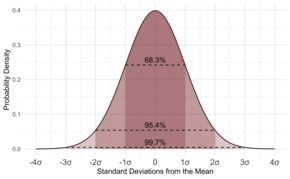

# Populations and Samples

 __The primary __    _objective_    __ of a statistical analysis is to infer __    _characteristics_    __ of a __    _group_    __ of data by __    __analyzing__    __ the __    _characteristics_    __ of a __    _small_    __ __    _sampling_    __ of the group.__ 

 _Population_  : In statistics, a  __population__  (also called a universe) is a  _set_  of similar  _items_  or  _events_  which is of  _interest_  for some question or experiment.

For  _small_  populations, we can obtain  _all_  values. However, populations are normally so large that obtaining all the measurements is unfeasible.

 __Sample __  is a set of individuals or objects  _collected_  or  _selected_  from a statistical population by a  _defined_   _procedure_.

To sample a population  _randomly_  requires that  _each_   _member_  of the population has an  _equal_  and independent  _chance_  of being  _selected_.

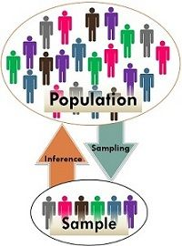

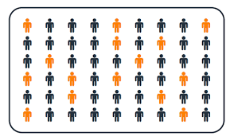

# Difference Between Probability and Statistics

Probability  starts with a model describing what    _events_    we think are going to    _occur_, with what    _likelihoods_. 

For    _example_, flipping a fair coin, the probability of heads on a given flip is 50%, and the probability of tails on a given flip is 50%. Probability is about    _prediction_, thus, looking  forward.

Statistics  is the    _opposite_, given only the    _data_, try to    _guess_    what the    _rules_    are. Statistics is about looking  backward.

---

In probability, we start with a model describing what events we think are going to occur, with what likelihoods. 
For example, flipping a fair coin, the probability of heads on a given flip is 50%, and the probability of tails on a given flip is 50%. Probability is about prediction, thus, looking forward.

Statistics is the opposite, given only the data, try to guess what the rules are. Statistics is about looking backward.

 

# Probability Theory

 _Probability_   theory is the branch of mathematics  _concerned_  with probability, which measures  _how_   _likely_  an  _event_  is to  _occur_.

It was triggered by the desire to  _predict_   _outcomes_  in the  _games_  of chance popular among the French nobility of the mid-seventeenth century such  _cards_  and  _dices_.

Earlier work was done by writers such as  __Girolamo__  __ Cardano __ (1501-1576) and  __Galileo Galilei__  (1564-1642)

It was developed between two great French mathematicians,   __Blaise Pascal __  (1623-1662) and   __Pierre Fermat __  (1601-1665).

# Basic Concepts in Probability (1/5)

 __Random experiment __  is an action for which  _all possible outcomes_  can be listed, but for which the  _actual_  outcome on any given trial of the experiment  _cannot_  be  _predicted_  with  _certainty_.

* For example, a coin has two sides and when tossed will land with either the "head" side (H) up or the "tail" side (T) up, but not both. Or, a die has six sides and when thrown will land with either the 1, 2, 3, 4, 5, or 6 side up.

 __Sample space __  associated with a random experiment is  _the set of all possible outcomes _ (H or T with the  _coin_; or 1, 2, 3, 4, 5, or 6 with the  _die_ ).

 __Probability of an__       __outcome __  is a number p between 0 and 1 that measures the likelihood that this outcome will occur on a single trial. The value  _p = 0_  corresponds to the outcome e being  _impossible_  and the value  _p = 1_  corresponds to the outcome e being  _certain_.

 __Set __  is a defined  _collection of items_. For example, the number rolled is odd {1,3,5} or even {2,4,6}.

 __Event__, a set of outcomes is an   __event__   __. __ The   __probability of an event __  is the sum of the probabilities of the individual outcomes of which it is composed. It is denoted P(A).

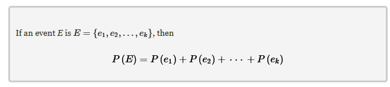

# Basic Concepts in Probability (2/5)

 _The intersection of events_   __ __ A and B, denoted A ∩ B,  _is the collection of all outcomes that are elements of both of the sets A and B_. It corresponds to combining descriptions of the two events using the word "and."

If two events have  _no elements in common_, they are said to be  _mutually exclusive_, and the two sets are said to be   __disjoint__.  The set that is the intersection of disjoint sets contains no elements and is often called the   __empty__   __ __   __set__   __ __ or the null set.

_For example_, the events   __"odd-numbered rolls" __  and   __"even-numbered rolls" __  are mutually exclusive and there are  _no elements common to both of them_.

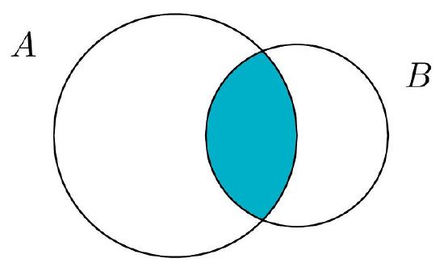

# Basic Concepts in Probability (3/5)

 _The union of events_    __ __  A and B, denoted A ∪ B,  _is the collection of all outcomes that are elements of one or the other of the sets A and B, or of _   _both_   _ of them._

It corresponds to combining descriptions of the two events using the word "or.".

_For example_, The union of the events   __"odd numbered" __  and   __"rolls greater or equal than 2"__ 

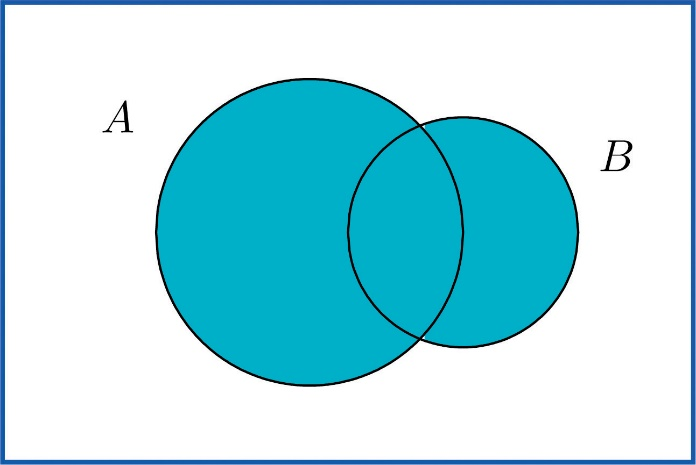

_1  2  3  4  5  6_

# Basic Concepts in Probability (4/5)

__Multiplying probabilities__

* If two or more events   __intersect__, the probability associated with the intersection is the   __product__   of the probabilities of the   __individual__   events. That is,

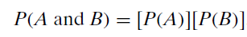

* _Example_, the probability of a tossed coin  _landing_   _heads_  is 0.5. If  _two_   _coins_  are tossed, the   __probability of __    _both_    __ coins landing heads is:__ 

* P(H,H) = [P(H)][P(H)] = 0.5 \* 0.5 = 0.25
---

Date due monete l'insieme completo degli eventi lancio è
TT, TC, CT, CC, l'evento che ci interessa è TT quindi la sua probabilità P è 1/4 che è il prodotto di 1/2 * 1/2, che sono le probabilità che una moneta esca con Testa (head) 

# Basic Concepts in Probability (5/5)

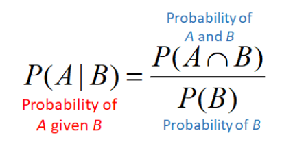

__Conditional probabilities__

*  __Conditional__   probability is the probability of one event with the   __stipulation__   that   _another event also occurs._ 

---

Teorema di Bayes
Spade = pala, badile, quindi PICCHE

ATTENZIONE: NON è LA PROBABILITA CHE ESCA REGINA DI PICCHE, QUELLA VARREBBE 1/52
E LA PROB CHE QUANDO ESCA UNA CARTA DI PICCHE SIA ANCHE LA REGINA!!!!

Quindi nel nostro caso occorre intersecare la probabilità di avere una regina (ho 4 regine su 52 carte) con la probabilità che esca una carta picche, che è 13 su 52). 
Il tutto dividendo la probabilità di avere una carta di picche che è 13 su 52
---------------------------------------------------------------------------------------------
Altro esempio probabilità che due dadi identici diano somma 6 con uno dei due dadi da cui esca 2

Se immaginiamo sia uscito 2, I casi possibili sono 11, cioè tutte le possibili coppie con 2

21, 22, 23, 24, 25, 26
12, 32, 42, 52, 62

I casi favorevoli (somma 6) sono solo 2, cioè 24 e 42

Quindi probabilità = 2/11

# Esempio

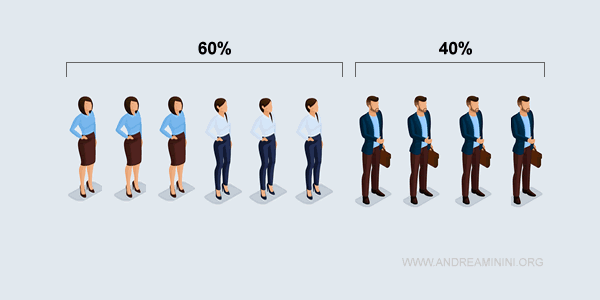

---

In un villaggio il 60% della popolazione è composto da donne, il 40% da uomini

Metà delle donne porta i pantaloni

# Agenda

* __Introduction__

* __DBMS, Big Data, Cloud solutions __

* __Data Analytics__

* __Data Management and Data Governance__

* __Computer programming__

* __Business Intelligence & Visualization of Data__

* __Statistics & Probability__

* __Machine Learning (ML)__

* __Artificial Intelligence (AI)__  __  __

# What is Machine Learning?

The  _primary aim_  is to allow the computers   __learn__     __automatically__     __without__     __human__     __intervention__   or   __assistance__   and adjust actions accordingly in order to enable better decisions at scale.​

A Machine Learning model uses   __supervised__   or   __unsupervised__   learning

A Machine Learning model can be   __deployed__   into an   __existing__   production   __environment__ 

A Machine Learning   __workflow__   can be   __automated__   by   __pipelines__ 

__Machine Learning__

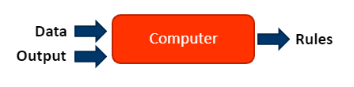

---

Definition:
‘Machine Learning (ML) provides systems the ability to automatically learn and improve from experience and/or from past cases, without being explicitly programmed. Machine learning focuses on the development of computer programs that can access data and use it to learn for themselves. However, if there is no past then no predictions can be made.' 

# Machine Learning vs Traditional Programming

 _Traditional programming _  differs significantly from machine learning. In traditional programming,  _a programmer codes all the rules_  in consultation with an  __expert__  in the industry for which software is being developed. Each rule is based on a  __logical__  foundation; the machine will  __execute__  an output following the logical statement. When the system grows  _complex_,  _more_  rules need to be  _written_. It can quickly become unsustainable to  _maintain_.

 _Machine learning _  is supposed to overcome this issue. The machine  _learns_  how the  _input_  and  _output_  data are  _correlated_  and it  _writes_  a  _rule_. The programmers do not need to write new rules each time there is new data. The algorithms  _adapt_  in  _response_  to  _new_   _data_  and  _experiences_  to improve efficacy over time.

# Machine Learning and Artificial Intelligence Systems

Machine Learning (ML) is a   _subset_   of Artificial Intelligence.

__Artificial Intelligence__

_Ability to sense, reason, engage, and learn_

Robotics & motion

Natural Language processing

__Machine Learning__

Planning & optimization

_Ability to learn_

Unsupervised learning

Voice

recognition

Knowledge

capture

Supervised learning

Reinforcement learning

_Ability to reason_

Regression

Decision Trees

etc.

_Physical enablement_

Platform

UX

APIs

Sensors

etc.

---

Add notes

# The Idea of Training and Learning from Data

_There are _  _several_  _ _  _types_  _ of machine learning _  _models_  _, of which the most common ones are _   _supervised_   _ and _   _unsupervised_   _ learning._

 _Algorithm_    _ _  in machine learning is   _a procedure that is run on data to create a machine learning "model." _ 

 _For _    _example_    _, f(x) = _    _ax_    _ + b, which is the general formula for linear regression._ 

Machine learning algorithms  _build_  a  _model_   _based_  on  _sample_  data, known as  _"_   _training_   _ _   _data_  ", in order to  _make_   _predictions_  or  _decisions_   _without_  being  _explicitly_   _programmed_  to do so.

 _Model_    _ _  in machine learning is the  _output of a machine learning algorithm run on data_.

 _For _    _example_    _, f(x) = 3x + 2._ 

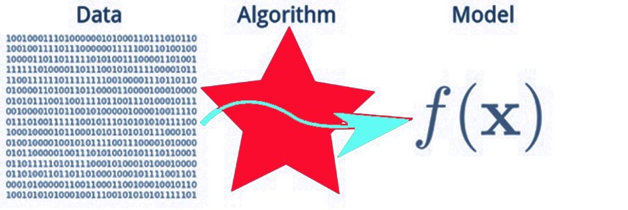

# The Processes of Training, Validating and Testing (1/3)

 __Train/Test split__ 

Keeping apart    _one_       _portion_    of the    _dataset_    (   __test set__   ) and    _training_    the model on the    _remaining_       _portion_    (   __train set__   ).

The model has    _never_       _seen_       _before_    the    _test_       _set_, hence it is a more    _reliable_    benchmark for evaluation purposes. 

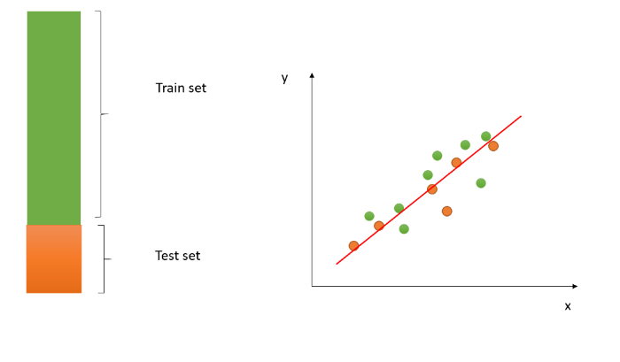

---

Keeping apart one portion of the dataset (test set) and training the model on the remaining portion (train set).

The model has never seen before the test set, hence it is a more reliable benchmark for evaluation purposes. 

# The Processes of Training, Validating and Testing (2/3)

 __Cross-validation__ 

Train/Test split has one caveat,    _results depends on where the split is done_.   

If we had a    _different_    composition of train and test set, we would have a    _very_       _different_    result.

Cross-validation    _splits_    our dataset into    _K-folds_, then the model is trained on    _K-1 folds_    and tested on the    _remaining_       _one_, for    _K iterations_. 

So    _each_       _time_    the model is    _trained_    and    _tested_    on a    _new_       _composition_    of data.

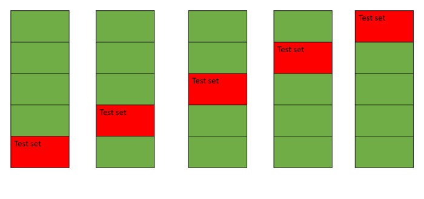

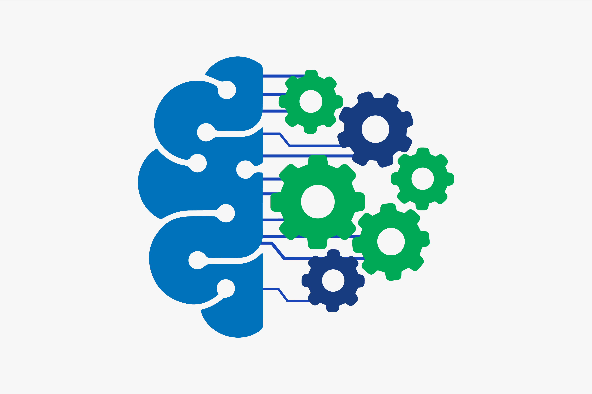

---

Train/Test split has one caveat, results depends on where the split is done. 
If we had a different composition of train and test set, we would have a very different result.

Cross-validation splits our dataset into K-folds, then the model is trained on K-1 folds and tested on the remaining one, for K iterations. 
So each time the model is trained and tested on a new composition of data.

# The Processes of Training, Validating and Testing (3/3)

 __Train, validation and test set__ 

With cross-validation,    _still_    the model have    _seen_       _all_    the data at    _some_       _point_.

To fix it, a    _third_       _set_, called    _validation_       _set_, is    _introduced_.

Basically, we    _first_       _split_    data into    _train_    and    _test_    set. 

Then, we keep    _apart_    the    _test_    set and    _further_       _split_    the    _train_    set into    _train_    and    _validation_    sets. 

By doing so, when applying cross-validation, we first    _evaluate_    the    _model_    over the    _K_       _possible_    combinations.

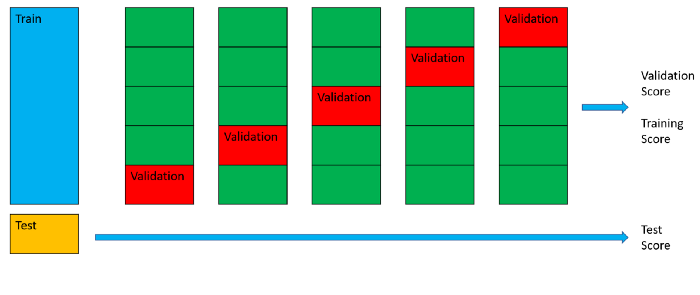

---

La parte azzurra viene poi divisa in train verde e validation rosso

Ultimo test è sul set giallo

# Understand Various Methods of Learning (1/5)

# Understand Various Methods of Learning (2/5)

Machine learning    _algorithms_    are often    _categorized_    as    __supervised__    or    __unsupervised__.

 _Supervised_    __ machine learning algorithms __       _apply_    _ _    _what_    _ has been _    _learned_    _ in the _    _past_    to    _new_       _data_    using    __labeled__    __ __    __examples__    __ __   to    _predict_       __future__    events. 

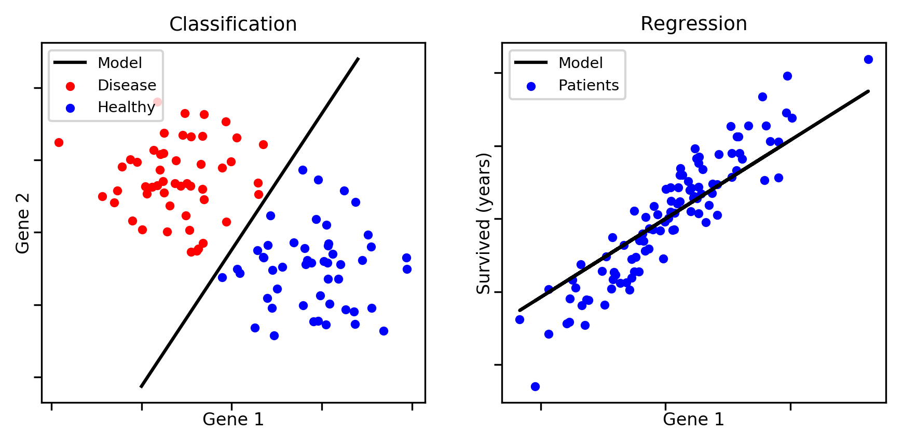

# Supervised Learning | (3/5)

 __Classification__ 

 __Classification is concerned with building models that __    _separate_    __ __    _data_    __ into __    _distinct_    __ __    _classes_ 

These models are built    _FIRST_    by    _inputting_    a set of    _training_    data for which the    _classes_    __ are __    _PRE-LABELLED_    __ in order for the algorithm to learn __ 

The model is    _THEN_    used by    _inputting_    a    _different_       _dataset_    for which the classes are    _WITHHELD_, allowing the model to    _predict_    their class membership based on what it has    _learned_    from the    _training_    set

Well-known classification schemes include    __decision__    __ __    __trees__    and    __support vector machines__ 

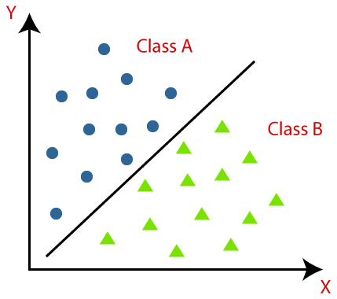

---

Witheld = nascosto
In pratica funziona cosi
Ti do in pasto un bel pò di dati labelled per cui vedi chi appartiene a categoria A e chi a B
Ti do in pasto un mucchio di dati per I quali non è evidente a quale categoria appartengano e devi riconoscere l'appartenenza basandoti su ciò che hai appreso precedentemente

# Supervised Learning | (4/5)

 _Regression_ 

 __Regression__    _ _    __methods focus on __    _predicting_    __ a __    _continuous_    __ __    _outcome_    __ variable (y) __    _based_    __ on the value of one or __    _multiple_    __ __    _predictor_    __ variables (x).__ 

_The goal of regression model _ is to  _build_  a  _mathematical_   _equation_  that defines y as a  _function_  of the x variables.  _Next, this equation can be used to predict the outcome (y) on the basis of new values of the predictor variables (x)._

 __Linear regression__      is the most simple and popular technique for predicting a continuous variable.    _It assumes a linear relationship between the outcome and the predictor variables_.

The linear regression equation can be written as y = a + b\*x + e, where:    

* a is the intercept,    

* b is the regression weight or coefficient associated with the predictor variable x.

* e is the residual error 

Well-known regression algorithms include th  e linear    __L__    __asso __  and     __Ridge __  regressions and the non-linear   __Regression Trees__ 

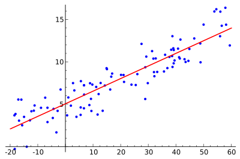

---

The acronym "LASSO" stands for Least Absolute Shrinkage and Selection Operator.

# Understand Various Methods of Learning (5/5)

 __Reinforcement machine learning algorithms __   interact with their environment by producing actions and discovering errors or rewards. 

 __Trial and error search __   and    __delayed reward __   are the most relevant characteristics of reinforcement learning. 

Allows machines and software agents to    _automatically_       _determine_    the    _ideal_       _behavior_    within a specific context in order to maximize its performance.

Simple    _reward_       _feedback_    is required for the agent to learn which action is best - a    __reinforcement signal__.

# Reinforcement Learning | Example

Using reinforcement learning, AlphaGo Zero was able to  _learn_  the game of Go from  _scratch_.

It  _learned_  by  _playing_   _against_   _itself_.

Alpha Go Zero was able to  _outperform_  the version of Alpha Go known as Master that has  _defeated_  world number one   __Ke__    __ __    __Jie__.

It only used black and white stones from the board as input features.

The agent is composed by a  _neural_   _network_.

AlphaGo Zero played against itself millions of times, and with time and its own creativity, it had managed to find these techniques used by the masters of Go.

---

AlphaGo è un software per il gioco del go sviluppato da Google DeepMind. È stato il primo software in grado di sconfiggere un maestro umano nel gioco senza handicap e su un goban di dimensioni standard

# Agenda

* __Introduction__

* __DBMS, Big Data, Cloud solutions __

* __Data Analytics__

* __Data Management and Data Governance__

* __Computer programming__

* __Business Intelligence & Visualization of Data__

* __Statistics & Probability__

* __Machine Learning (ML)__

* __Artificial Intelligence (AI)__  __  __

# What is Artificial Intelligence?

AI is concerned with getting    __computers__    to    __do__       __tasks__    that would    __normally__    require    __human intelligence__.  ​

AI refers to a broad field of science encompassing    _not_       _only_    computer science but    _also_       __psychology__,    __philosophy__,    __linguistics__    and other areas.  ​

 __Applications:__   ​

Machine learning  ​

Computer Vision  ​

Natural language processing (NLP)  ​

Robotics & Motion  ​

Planning and optimization  ​

Knowledge capture

---

Definition:
‘Artificial Intelligence (AI) is the science and engineering of making intelligent machines, especially intelligent computer programs' 
- Alan Turing

# Artificial Intelligence (AI)

_"AI is the science and engineering of making intelligent machines, especially intelligent computer programs." _

_(Alan Turing)_

# AI: definition and types

 _Intelligence demonstrated by machines_ 

 _According to the Computer Science view:_ 

 __" Intelligent agents"__    perceiving their environment and taking    __actions__    to achieve a    __goal__.

 _Narrow or Weak AI_    __ __   performs some    __traditional__       __goals__ 

* Reasoning, planning, learning, natural language processing, image recognition ...

 _Artificial general intelligence (AGI)_, also    __called__       _Strong AI_   :

* Performs a full range of human abilities

* Some predict it will be 2050 before we can achieve this

*  _We are not sure if we will ever understand consciousness_ 

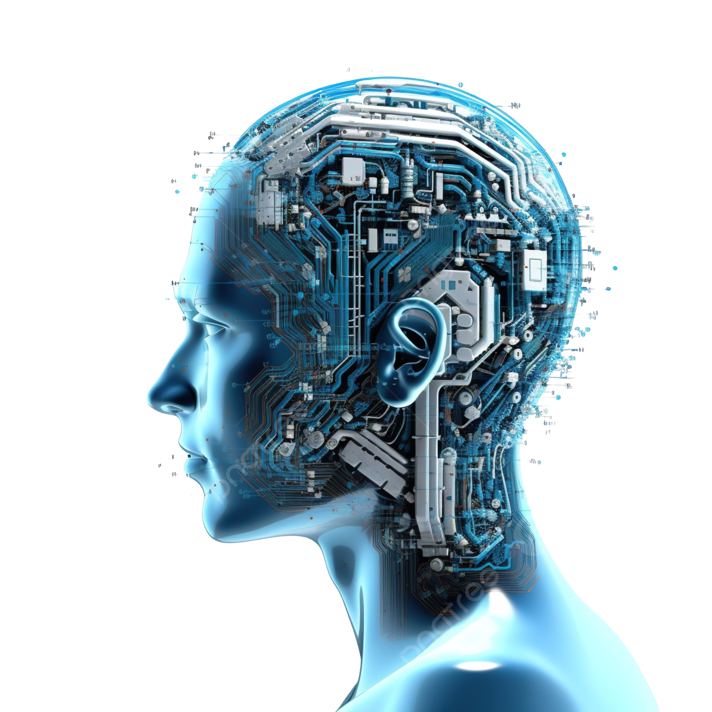

---

Explain the definition of AI, the computational science view. It somehow misses the point of what emotions are. Explains that we are already good at narrow AI; engineers and scientists use this every day. 
 
Strong or artificial general intelligence is some way off; it will be able to perform the full range of human abilities, possibly exceed them, but it is a long way off. Academics believe we will achieve this but we just don't know when, and certainly not any time soon. 

# Artificial intelligence and the rational agent - 1/2

Agent comes from the Latin "agere" - to do.

In AI we assume   _agents_   are   _rational_   and are   _expected_   to achieve the   _best_   outcome or   _best_     _expected_   outcome if there is   _uncertainty_. They also act "  _autonomously_  "\!

_There are other approaches based on human behaviour or human thought but this approach is the most amenable to scientific development._

---

In, decision theory and artificial intelligence, a rational agent is an agent that has clear preferences, models uncertainty via expected values of variables or functions of variables, and always chooses to perform the action with the optimal expected outcome for itself from among all feasible actions.

# Artificial intelligence and the rational agent - 2/2

*  __Stuart Russell __   and    __Peter __    __Norvig__   's   book,    _Artificial Intelligence - A Modern Approach_, 3rd edition, defines a    __rational__       __agent__ 

*  _"For each possible percept sequence, a rational agent should _    _select_    _ an action that is _    _expected_    _ to _    _maximize_    _ its performance measure, given the _    _evidence_    _ _    _provided_    _ by the _    _percept_    _ sequence and _    _whatever_    _ built in _    _knowledge_    _ the agent has."_ 

* We expect agents to be rational and this depends on    _four things_   :

* The performance    _measure_    that defines the criterion of    _success_ 

* The agent's prior    _knowledge_    of the    _environment_ 

* The    _actions_    that the agent    _can_    perform

* The agent's    _percept_       _sequence_    to date

---

Behaved = educati
This slide describes our learning agent as rational; this is made up of four things. Go through the Russell and Norvig explanation of a rational agent and ask delegates if they have examples of where they could apply this (simulations of traffic or aircraft perhaps).

# Schematic of AI (the Computer Science view) - 1/2

__External Task Environment __

__Percept __

_the collective term of all the agent's perceptual inputs at any given time _

__Action__

_to manipulate the environment_

* _"Learn from experience, adapt, understand and handle abstract _  _concepts_  _, manipulate our environment"._
---

The term "Percept" is the collective term of all the agent's perceptual inputs at any given time 

Encyclopaedia Britannica IQ mental quality that consists of the abilities to learn from experience, adapt to new situations, understand and handle abstract concepts, and use knowledge to manipulate one's environment

Describe the key components of the Schematic of Artificial Intelligence. Also make the link between the Britannica definition of human intelligence and this schematic. 

# Schematic of AI (the Computer Science view) - 2/2

__External Task Environment __

__Percept __

_the collective term of all the agent's perceptual inputs at any given time _

* Architecture

* __Percept__  obtained from sensors

* __Program__  delivers the agent functionality: mapping sensor precept to actuator actions

* __Action__  undertaken by actuators

__Action__

_to manipulate the environment_

* _"Learn from experience, adapt, understand and handle abstract _  _concepts_  _, manipulate our environment"._

 _A program will run on a computing device, improving its performance through learning _ 

---

These slides explain the main terms that let the learning agent manipulate and understand its environment and map its percept of the environment to actions on the environment. 

# Agent examples

| Agent Description | Performance Measure | Environment | Actuators | Sensors |
| :-: | :-: | :-: | :-: | :-: |
| __Central heating thermostat__ | Temperature, heating cost | Building, inhabitants, heating system | Inhabitant display, boiler, power | Temperature, keypad, phone, computer |
| __Interactive sales chatbot__ | Number of sales | Customers, sale environment (internet, store, phone) | Robot, display, speaker | Keyboard, microphone, camera, kinesthetic sensors |

---

Go through each of these examples and ask for examples from the delegates.

# Types of agent - 1/2

*  _Reflex agent _ 

* the program selects actions based on the current precept 

* simple to understand and program  

 _e.g. central heating overheats, program selects the action to switch off the power_ 

*  _Model-based reflex agent_ 

The agent has a model of the world

* can make up for a lack of sensor (virtual world that doesn't need sensor data)

* program now looks at the percept and updates its own internal world (state)

* program can assess the possible actions and future states and uses reflex agent  approach to determine what actions to take 

 _e.g. underwater vehicle loses visual sensors (silt - not enough light), continues using 3D mapped geometrical model _ 

---

1. Agente riflesso semplice
Gli agenti riflessi semplici prendono decisioni basandosi esclusivamente sull'input corrente, senza considerare i risultati passati o potenziali futuri. Reagiscono direttamente alla situazione corrente senza stato interno o memoria.

Esempio: un termostato che accende il riscaldamento quando la temperatura scende sotto una certa soglia, ma non tiene conto delle precedenti letture della temperatura o delle previsioni meteo a lungo termine - fig Bonaire Gas Heater Overheat Switch 120 Deg. 5431606SP

Caratteristiche dell'agente riflesso semplice:
Reattivo: reagisce direttamente agli input sensoriali attuali senza considerare le esperienze passate o le conseguenze future.
Ambito limitato: in grado di gestire compiti o ambienti semplici con relazioni causa-effetto chiare.
Risposta rapida: prende decisioni rapide basandosi esclusivamente sulla situazione attuale, consentendo una rapida esecuzione delle azioni.
Mancanza di adattabilità: incapacità di apprendere o adattarsi in base al feedback, il che lo rende meno adatto ad ambienti dinamici o in continua evoluzione.

2. Agenti riflessi basati su modelli
Gli agenti riflessi basati su modelli migliorano gli agenti riflessi semplici incorporando rappresentazioni interne dell'ambiente. Questi modelli consentono agli agenti di prevedere i risultati delle loro azioni e prendere decisioni più informate. Mantenendo stati interni che riflettono aspetti inosservati dell'ambiente e utilizzando percezioni passate, questi agenti sviluppano una comprensione completa del mondo. Questo approccio li equipaggia per navigare efficacemente in ambienti complessi, adattarsi a condizioni mutevoli e gestire l'osservabilità parziale.

Esempio: un sistema di guida autonoma non solo reagisce alle condizioni stradali attuali, ma tiene conto anche della conoscenza delle regole del traffico, delle mappe stradali e delle esperienze passate per navigare in sicurezza.

Caratteristiche Agenti riflessi basati sul modello
Adattivo: mantiene un modello interno dell'ambiente per anticipare stati futuri e prendere decisioni informate.
Comprensione contestuale: considera sia gli input correnti sia i dati storici per determinare le azioni appropriate, consentendo un processo decisionale più articolato.
Sovraccarico computazionale : richiede risorse per creare, aggiornare e utilizzare il modello interno, con conseguente aumento della complessità computazionale.
Prestazioni migliorate: può gestire attività e ambienti più complessi rispetto ai semplici agenti riflessi, grazie alla sua capacità di incorporare esperienze passate.

# Types of agent - 2/2

*  _Goal-based agent _ 

* the program needs more than just sensors and an internal world to implement the agent's functionality - it needs a goal

* these programs are more versatile and flexible - can adapt to changes  

 _e.g. autonomous vehicle can choose one of five exits from a motorway, the goal (safest,_    _quickest, most scenic, cheapest, shortest)  _ 

*  _Utility-based reflex agent_ 

* Utility is the scientific way economists measure an agent's happiness; it's more versatile than a yes/no happy or unhappy - it measures how useful it is.

 _e.g. _    _Chatbot_    _ doctor assesses the efficacy of a treatment based on patient's needs _ 

---

3. Agenti basati sugli obiettivi
Gli agenti basati sugli obiettivi hanno obiettivi predefiniti o traguardi che mirano a raggiungere. Combinando descrizioni di obiettivi e modelli dell'ambiente, questi agenti pianificano di raggiungere obiettivi diversi, come raggiungere destinazioni particolari. Utilizzano metodi di ricerca e pianificazione per creare sequenze di azioni che migliorano il processo decisionale al fine di raggiungere gli obiettivi. Gli agenti basati sugli obiettivi differiscono dagli agenti riflessi perché includono processi decisionali lungimiranti e orientati al futuro.

Esempio : un robot per le consegne incaricato di consegnare pacchi in luoghi specifici. Analizza la sua posizione attuale, la destinazione, i percorsi disponibili e gli ostacoli per pianificare un percorso ottimale verso la consegna del pacco.

Caratteristiche degli agenti basati sugli obiettivi:
Intenzionale: opera con obiettivi predefiniti, fornendo una direzione chiara per il processo decisionale e la selezione delle azioni.
Pianificazione strategica: valuta le azioni disponibili in base al loro contributo al raggiungimento degli obiettivi, ottimizzando il processo decisionale per il loro raggiungimento.
Definizione delle priorità degli obiettivi: è possibile stabilire le priorità degli obiettivi in ​​base alla loro importanza o urgenza, consentendo un'allocazione efficiente delle risorse e degli sforzi.
Flessibilità degli obiettivi: capacità di adattare gli obiettivi o di modificare le strategie in risposta ai cambiamenti dell'ambiente o alle nuove informazioni.

4. Agenti basati sull'utilità
Gli agenti basati sull'utilità vanno oltre i metodi di base orientati agli obiettivi tenendo conto non solo del raggiungimento degli obiettivi, ma anche della qualità dei risultati. Utilizzano funzioni di utilità per valutare vari stati, consentendo confronti dettagliati e compromessi tra diversi obiettivi. Questi agenti ottimizzano la soddisfazione complessiva massimizzando l'utilità attesa, considerando le incertezze e l'osservabilità parziale in ambienti complessi. Anche se il concetto di agenti basati sull'utilità può sembrare semplice, la loro implementazione efficace comporta una modellazione complessa dell'ambiente, della percezione, del ragionamento e dell'apprendimento, insieme ad algoritmi intelligenti per decidere il miglior corso d'azione di fronte alle sfide computazionali.

Esempio: un algoritmo di un consulente finanziario suggerisce opzioni di investimento prendendo in considerazione fattori quali potenziali rendimenti, tolleranza al rischio e requisiti di liquidità, con l'obiettivo di massimizzare la soddisfazione finanziaria a lungo termine dell'investitore.

# What was missing?

 _The learning from experience_ 

*  _Stuart Jonathan Russell_    (born 1962) is a British computer scientist known for his contributions to artificial intelligence. He is a professor of computer science at the University of California, Berkeley and was from 2008 to 2011 an adjunct professor of neurological surgery at the University of California, San Francisco

*  _Peter _    _Norvig_    _ _   (born December 14, 1956) is an American computer scientist and Distinguished Education Fellow at the Stanford Institute for Human-Centered AI. He previously served as a director of research and search quality at Google

---

Stuart Jonathan Russell OBE (born 1962) is a British computer scientist known for his contributions to artificial intelligence (AI).[5][3] He is a professor of computer science at the University of California, Berkeley and was from 2008 to 2011 an adjunct professor of neurological surgery at the University of California, San Francisco

Peter Norvig (born December 14, 1956) is an American computer scientist and Distinguished Education Fellow at the Stanford Institute for Human-Centered AI.[4] He previously served as a director of research and search quality at Google

# Russell and Norvig - a general learning agent

 __What the sensors say about the agent's performance__ 

__External Task Environment __

 __Responsible for learning and improvement__ 

Learning element

Performance element

Problem generator

 __Makes suggestions that are exploratory __ 

---

In intelligence and artificial intelligence, an intelligent agent (IA) is an agent that perceives its environment, takes actions autonomously in order to achieve goals, and may improve its performance with learning or acquiring knowledge.

Delegates should now be able to see where the learning comes in, describe the learning element and how it relates to the agent models. The dotted line is sometimes thought of as the control or robot system. We might think of the left-hand side of this schematic as where machine learning fits in.

__Grazie per la vostra attenzione\!__

 __Doriano Gallozzi__ 

[doriano.gallozzi@hspi.it](mailto:doriano.gallozzi@hspi.it)

335 - 822 3139

